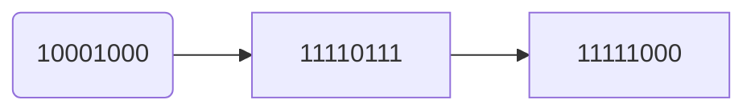

# C语言题库

## 第1章 程序设计与C语言

1.  `编程题`  `简单` `30分`

```
Hello World!

编写一个C程序，运行时输出

********************

Hello World!

********************
```

```c
#include "stdio.h"
int main()
{
	printf("********************\n");
	printf("Hello World!\n");
	printf("********************");
	return 0;
}
```

2. `编程题` `简单``30分`

```
输出文本

编写一个C程序，输出： This is a C program.
```

```c
#include  "stdio.h"			
int main()				 
{				 
    printf("This is a C program.\n");	
    return 0;			
}
```

3. `编程题`  `简单` `40分`

```
用*号输出字母C

编写一个C程序，用*号输出字母C的图案。
```

```c
#include "stdio.h"
int main() 
{
	printf("****\n");
	printf("*\n");
	printf("*\n");
	printf("****");
  return 0;
}
```

## **第2章 算法(略)**

## **第3章 顺序程序设计**

1. ``单选题`` ``简单`` ``3分``

```c
以下选项中可作为C语言数值常量的是（ ）。

A.-80.0✅

B.-080

C.-8e1.0

D.-80.0e
```

**回答正确**

**解析**

C语言中的数值常量有整型常量和实型常量两种，其中整型常量的表示有三种形式：八进制、十进制和十六进制。**八进制数以数字0开头，后跟0\~7数字序列**，**如022和-016都是合法的八进制整型常量**；十进制数以正负号开头（正号可以省略），后跟0\~9数字序列，如**198，-12都是合法的十进制整型常量**；**十六进制数以0x开头，后跟0\~9或A\~F数字序列，如0x13，-0x1C都是合法的十六进制整型常量**。实型常量有两种表示方法：普通形式，一般用小数表示，小数点不能省略，**如3.14**；指数形式，指数的表示通过'e'或'E'后跟**一个整数表示以10为底的幂**，C语言规定'e'或'E'的**前后都必须有数字，并且后边的必须为整数**。B选项是一个非法的八进制整型数据，C选项'e'后边不是整数，而D选项'e'后边没有数字，这都是不合法的实型常量。

**+ 3.0 分**

**2 .** ``单选题`` ``简单`` ``3分``

```c
对于char cx='\039';正确的判断是（ ）。

A.不合法✅

B.cx的值是'\03'

C.cx的值为四个字符

D.cx的值为三个字符
```

**回答正确**

**解析**

本题考查了C语言字符数据的写法，由于cx变量为char类型，**只能接收一个字符数据**，而\'\\039\'如果作为八进制ASCII码表示的数据来对待是不合法的。

\ **八进制**转义

\x **十六进制**转义

**+ 3.0 分**

**3 .** ``单选题`` ``简单`` ```3分```

```c
以下选项中合法的C语言标识符是（ ） 。

A.long

B._2Test✅

C.3Dmax

D.A.dat
```

**回答正确**

**解析**

本题考查C语言标识符的命名规则，**C语言规定标识符中只能含有字母。数字和下划线三种字符**，**不能以数字字符开头**，并且不能使用C语言关键字。long为C语言数据类型关键字，3Dmax以数字字符开头，A.dat包含有'.'字符，都是不符合标识符命名规则的。

**+ 3.0 分**

**4 .** ``单选题`` ``中等`` ``3分``

```c
设有int x=11;则表达式(x++*1/3)的值是（ ）。

A.3✅

B.4

C.11

D.12
```

**回答正确**

**解析**

本题考查了算术混合运算时**运算符的优先级**及含义。表达式中既有**一元运算符也有二元运算**符，C语言规定**一元**运算符**优先级高于二元**运算符，优先级相同的**算术运算符按照从左到右**的次序进行运算，所以表达式等价于（（x++）*1）/3 ,其中自增运算符在变量右边表示先引用变量值在进行自增，/用于整型数据时表示取两数相除的商，因此结果为**11*1/3=3**。

| 优先级     | 运算符名称         | 符号                                                         |
| ---------- | ------------------ | ------------------------------------------------------------ |
| 第1优先级  | **各种括号**       | 如**()、[]**等、成员运算符 .                                 |
| 第2优先级  | 所有**单目运算符** | 如**++、–、!、~**等；                                        |
| 第3优先级  | **算数运算符**     | 乘法运算符*、除法运算符/、求余运算符%；                      |
| 第4优先级  | **算数运算符**     | 加法运算符+、减法运算符-；                                   |
| 第5优先级  | **移位运算符**     | 移位运算符<<、>>；                                           |
| 第6优先级  | **条件运算符**     | 大于运算符>、大于等于运算符>=、小于运算符<、小于等于运算符<=； |
| 第7优先级  | **条件运算符**     | 等于运算符==、不等于运算符!=；                               |
| 第8优先级  | **按位运算符**     | 按位与运算符&；                                              |
| 第9优先级  | **按位运算符**     | 按位异或运算符^；                                            |
| 第10优先级 | **按位运算符**     | 按位或运算符                                                 |
| 第12优先级 | **逻辑或运算符**   | 逻辑或运算符                                                 |
| 第13优先级 | **三目条件运算符** | ?: ；                                                        |
| 第14优先级 | 各种**赋值运算符** | 如=、+=、-=、*=、/= 等；                                     |
| 第15优先级 | **逗号**运算       | (,)                                                          |

**总结：**
**算数运算符>移位运算符>条件运算符>按位运算符>逻辑运算符>赋值**
同一优先级的运算符，运算次序由**结合方向**所决定。

**+ 3.0 分**

**5 .** ``单选题`` ``中等`` ``3分``

```c
设以下变量均为int类型，则值不等于7的表达式是（ ）。

A.(x=y=6,x+y,x+1)

B.(x=y=6,x+y,y+1)

C.(x=6,x+1,y=6,x+y)✅

D.(y=6,y+1,x=y,x+1)
```

**回答正确**

**解析**

本题考查**逗号运算符和逗号表达式**。逗号运算符是所有运算符中优先级最低的，运算时**从左至右**对其中的多个表达式分别计算，而整个逗号表达式的值则为**最右边表达式的值**。

**+ 3.0 分**

**6 .** `单选题` `中等` `3分`

```c
假定有变量定义：int k=6,x=12;则能使x的值为5、k值为6的表达式是（ ）。

A.x%=++k%10

B.x%=k+k%5✅

C.x-=++k%5

D.x-=k++%5
```

**回答正确**

**解析**

本题考查了算术运算符和复合赋值运算符。A选项的表达式等价于x=x%(++k%10),其中自增运算符在变量的左边，变量值先自增在使用，因此表达式运算后k值为7，x值为5；B选项的表达式等价于x=x%(k+k%5)，表达式中不存在修改k值的运算，x最终值为5;C选项的表达式等价于x=x-(++k%5)，表达式运算后k值为7，x值为10；D选项表达式等价于x=x-(k++%5)，自增运算符在变量右边，先引用变量值再进行变量自增，因此，表达式运算后k值为7，x值为11。

**+ 3.0 分**

**7 .** `单选题` `中等` `3分`

```c
设int a=0,b=0,m=0,n=0;则执行(m=a==b)||(n=b==a)后m和n的值是（ ）。

A.0，0

B.0，1

C.1，0✅

D.1，1
```

**回答正确**

**解析**

**真||假==真，有一个真都是真，有一个能到达目标就行**

**真&&假==假，有一个假是假，都要到达目标**

首先要考虑运算符混合运算时的优先级，优先级最高的是（）运算符，然后是括号内的关系运算符，再是括号内的赋值运算符，最后进行括号外的逻辑或运算。**当进行二元逻辑运算时，如果第一个逻辑运算操作数的值已经能够确定逻辑运算的结果，则系统不查看第二个逻辑运算的操作数**。本题中逻辑或运算的第一个操作数(m=a==b)值为1，已经能够确定逻辑或运算的结果为1，因此其第二个操作数不被查看，即描述第二个操作数的表达式不被执行，n的值不被改变。

**+ 3.0 分**

**8 .** `单选题` `中等` `3分`

```c
表达式!x||a==b等效于（ ） 。

A.!((x||a)==b)

B.!(x||y)==b

C.!(x||(a==b))

D.(!x)||(a==b)✅
```

**回答正确**

**解析**

两个表达式等效指变量取值相同时，表达式的结果也相同。本题表达式中包括逻辑运算和关系运算，有一元运算和二元运算，**优先级为一元优先级高于二元优先级**，**关系运算优先级高于逻辑运算**，因此题干中的表达式等价于D选项表达式。

**+ 3.0 分**

**9 .** `单选题` `中等` `3分`

```c
若有int i=5,j=4,k=6;float f;执行语句

f=(i<j&&j<k)?i:(j<k)?j:k;

后f的值为（ ）。

A.4.0✅

B.5.0

C.6.0

D.7.0
```

**回答正确**

**解析**

**条件运算符的结合性为自右向左**。因此f=(i\<j&&j\<k)?i:(j\<k)?j:k;等价于f=(i\<j&&j\<k)?i:((j\<k)?j:k);先计算出(j\<k)?j:k的值，为4，将该值参与第二次条件运算；第二次条件运算的表达式1为(i\<j&&j\<k)，表达式2为i，表达式3为(j\<k)?j:k，因此第二次条件运算的结果为4。因此f的值为4.0。

**+ 3.0 分**

**10 .** `单选题` `简单` `3分`

```c
若变量已正确定义并赋值，下面符合C语言语法的表达式是（ ）。

A.a:=b+1

B.a=b=c+2✅

C.int(18.5%3)

D.a=a+7=c+b
```

**回答正确**

**解析**

本题考查C语言中变量定义和赋值的语法，**C选项中%运算符只能用于整形数据的计算中**。

**+ 3.0 分**

**11 .** `单选题` `中等` `3分`

$与数学公式3x^n/(2x-1)对应的C语言表达式是（ ）。$

```c
A.
3*x^n/(2*x-1)

B.
3*x**n/(2*x-1)

C.
3*pow(x,n)/(2*x-1)✅

D.
3*pow(n,x)/(2*x-1)
```

**回答正确**

**解析**

C语言中没有进行指数运算的运算符，指数运算依靠数学函数pow完成。

**+ 3.0 分**

**12 .** `单选题` `中等` `3分`

```c
设x，y，u，v均为浮点型，与数学公式(x*y)/(u*v)不等价的C语言表达式是（
）。

A.x*y/u*v✅

B.x*y/u/v

C.x*y/(u*v)

D.x/(u*v)*y
```

**回答正确**

**解析**

这个题目包括数学表达式转换成C语言表达式时需要注意的问题，符号的书写，运算顺序的表示等。

**+ 3.0 分**

**13 .** `单选题` `简单` `3分`

```c
类型修饰符unsigned不能修饰（ ）。

A.char

B.int

C.long int

D.float✅
```

**回答正确**

**解析**

C语言中**无符号数据类型包括无符号整型、无符号短整型、无符号长整型、无符号字符型**。

**+ 3.0 分**

**14 .** `单选题` `简单` `3分`

```c
下列选项中，均是合法的C语言整型常量的是（ ）。

A.160 -0xffff 0011✅

B.-0xcdf 01a 0xe

C.-01 986,012 0668

D.-0x48a 2e5 0x
```

**回答正确**

**解析**

一个整型常量可以用3种不同的方式表示：

（1）十进制整数。以非零十进制数1～9组成的整数，例如135
，-246等；

（2）八进制整数。以0开头和八进制数0～7组成的整数，例如0，012，0177等；

（3）十六进制整数。以0x或0X开头和十六进制数0～9.A～F或a～f组成的整数（字母大小写任意），例如0x1234，0xab，0xCF等。B选项中01a不合法，C选项中986，012以及0668不合法，D选项中2e5以及0X不合法。

**+ 3.0 分**

**15 .** `单选题` `简单` `3分`

```
C语言中将-8赋值给无符号字符型，则它的内存数据形式为（ ）。

A.11111000✅

B.10001000

C.00001000

D.11110111
```

**回答正确**

**解析**



假定字长为8位时，-8的补码为11111000，赋值给无符号字符型时未发生溢出截断，所以仍为1111000。

|      |                      |
| ---- | -------------------- |
| %c   | 一个字符             |
| %d   | 有符号十进制整数     |
| %e   | 浮点数、e-记数法     |
| %f   | 浮点数、十进制记数法 |
| %o   | 无符号八进制整数     |
| %p   | 指针                 |
| %s   | 字符串               |
| %u   | 无符号十进制整数     |
| %x   | 使用十六进制数字     |
| %%   | 打印一个百分号       |
| %ld  | long                 |
| %hd  | short                |
| %lld | long long            |
| %u   | unsigned int         |
| %hu  | unsigned short       |
| %llu | unsigned long long   |
| %lu  | unsigned long        |

**+ 3.0 分**

**16 .** `单选题` `简单` `3分`

```c
设char a='\70';则变量a（ ）。

A.包含1个字符✅

B.包含2个字符

C.包含3个字符

D.说明不合法
```

**回答正确**

**解析**

转义字符的一种写法"\\ooo"， 用1～3位八进制数ooo为码值所对应的字符。

**+ 3.0 分**

**17 .** `单选题` `简单` `3分`

```c
（ ）是非法的C语言转义字符。

A.\b

B.\0xf✅

C.\037

D.\r
```

**回答正确**

**解析**

转义字符的一种写法"\\xhh"，
用1～2位十六进制数hh为码值所对应的字符。所以B选项错误。

常用的转义字符见下表

| 转义字符                              | 字符值                       | 输出结果                             |
| ------------------------------------- | ---------------------------- | ------------------------------------ |
| \\’                                   | 一个单撇号（’）              | 输出此字符                           |
| \\"                                   | 一个双撇号（"）              | 输出此字符                           |
| \\?                                   | 一个问号（?）                | 输出此字符                           |
| \                                     | 一个反斜线（\\）             | 输出此字符                           |
| \\a                                   | 警告（alert）                | 产生声音或视觉信号                   |
| \\b                                   | 退格（backspace）            | 将当前位置后退一个字符               |
| \\f                                   | 换页（form feed）            | 将当前位置移动到下一页的开头         |
| \\n                                   | 换行                         | 将当前位置移动到下一行的开头         |
| \\r                                   | 回车（carriage return）      | 将当前位置移动到本行的开头           |
| \\t                                   | 水平制表符                   | 将当前位置移动到下一个tab位置        |
| \\v                                   | 垂直制表符                   | 将当前位置移动到下一个垂直制表对齐点 |
| \\ooooo（其中o）代表一个八进制数字    | 与该八进制码对应的ASCⅡ字符   | 与该八进制码对应的字符               |
| \\xhhhhh（其中h代表一个十六进制数字） | 与该十六进制码对应的ASCⅡ字符 | 与该十六进制码对应的字符             |

本文只讨论倒数两行的十六以及八进制转义字符的使用

**+ 3.0 分**

**18 .** `单选题` `简单` `3分`

```c
以下选项中（ ）不是C语言常量。

A.e-2✅

B.012

C."a"

D.'\n'
```

**回答正确**

**解析**

实型常量的一种写法为指数形式，又称科学记数法表示。以fEn 或fen
格式组成的浮点数，其中E 或e 表示以10为低的幂， n为指数且必须是整型，
f可以是整数或小数。所以A选项错误。

**+ 3.0 分**

**19 .** `单选题` `简单` `3分`

```c
以下不是C语言支持的存储类别的是（ ）。

A.auto

B.static

C.dynamic✅

D.register
```

**回答正确**

**解析**

在变量定义时可以使用存储类别修饰符**auto、static、register来限定变量的存储类别**，使用extern来声明变量的外部连接属性。存储类别是指变量的存储空间分配方式，auto是变量默认的存储类别，称为自动变量；static是静态存储类别的变量，称为静态变量；register称为寄存器变量。

**+ 3.0 分**

**20 .** `单选题` `中等` `3分`

```c
已知short x=0xabcde; 则x的结果是（ ）。

A.赋值非法

B.不确定

C.abcd

D.bcde✅
```

**回答正确**

**解析**

一般地，超过最大值的有符号整型数值会向上溢出变成负数，超过最小值的数据会向下溢出变成正数。

**+ 2.0 分**

**21 .** `单选题` `中等` `2分`

```c
若int k=7,x=12;则值为3的表达式是（ ）。

A.
x%=(k%=5)

B.
x%=(k-k%5)

C.
x%=k-k%5

D.✅
(x%=k)-(k%=5)
```

**回答正确**

**解析**

A选项等价于：(1)k=k%5运算后k值为2；(2)
x=x%k运算后x值为0，赋值表达式值为0。B选项等价于：x=x%(k-k%5)，其中k-k%5的值为5，所以整个表示式运算后x值2，表达式值为2。
C选项等价与B选项。D选项等价于：(x=x%k)-(k=k%5)，其中x=x%k值为5，k=k%5表达式值为2，因此D选项表达式值为3。

**+ 2.0 分**

**22 .** `单选题` `中等` `2分`

```c
对于语句：f=(3.0,4.0,5.0),(2.0,1.0,0.0)；的判断中，（ ）是正确的。

A.
语法错误

B.
f为5.0

C.✅
f为0.0

D.
f为2.0
```

**回答正确**

**解析**

f=(3.0,4.0,5.0),(2.0,1.0,0.0)是一个**逗号表达式**，**赋值优先于逗号表达式**，第一个子表达式为f=(3.0,4.0,5.0)，因此f的值是逗号表达式(3.0,4.0,5.0)的值5.0；

f=(3.0,4.0,5.0),(2.0,1.0,0.0)这整个逗号表达式的值为子表达式(2.0,1.0,0.0)的值0.0。

逗号表达式的求解过程是：**先求解表达式1，再求解表达式2。整个逗号表达式的值是表达式2的值**

**+ 0.0 分**

**23 .** `单选题` `困难` `2分`

```c
设变量n为float类型，m为int型，则以下表达式能实现将n中的数值保留小数点后两位，第三位进行四舍五入运算。

A.
n=(n*100+0.5)/100.0

B.✅
m=n*100+0.5,n=m/100.0

C.
n=n*100+0.5/100.0

D.
n=(n/100+0.5)*100.0
```

**回答错误**

**解析**

很明显C和D选项不正确。A和B选项的差别仅在于A选项为两个实数相除，如对于12.123，最后n的值为12.128，没有达到四舍五入效果；而B选项先对12.123*100+0.5的结果转换为整型，所以m的值12.12（截掉了小数部分；如果第三位小数值大于等于5，此时整数部分会变为13），因此再除以100.0，n的值为12.12，相当于实现了第三位进行四舍五入运算。

**+ 2.0 分**

**24 .** `单选题` `中等` `2分`

```c
若变量a为int类型，且其值为3，则执行表达式a+=a-=a*a后，a的值是（ ）。

A.-3

B.9✅

C.-12

D.6
```

**回答正确**

**解析**

a+=a-=a*a等价与a=a+(a=a-a*a);括号运算后a的值为-6，括号内表达式值为-6；所以最后表达式值为-6+-6=-12。

a=a+(a-=a*a)

a=a+(a=a-a*a)

a=-6,a=-6-6

**+ 2.0 分**

**25 .** `单选题` `简单` `2分`

```c
关于C程序在作逻辑运算时判断操作数真、假的表述中，正确的是（ ）。

A.✅
0为假，非0为真

B.
只有1为真

C.
-1为假，1为真

D.
0为真，非0为假
```

**回答正确**

**解析**

逻辑运算符的运算对象可以是常量、变量或表达式，按逻辑值对待。在C语言中，非0数据当作真、0当作假。一般情况下，逻辑运算符的运算对象应是关系运算、逻辑运算的结果。因为这两种运算的结果是逻辑值，符合其要求。

**+ 2.0 分**

**26 .** `单选题` `简单` `2分`

```c
关于C程序关系运算、逻辑运算后得到的逻辑值的表述中，正确的是（ ）。

A.
假为0，真为随机的一个非0值

B.✅
假为0，真为1

C.
假为-1，真为1

D.
假为0，真为不确定的值
```

**回答正确**

**解析**

关系运算符的运算规则是：若关系成立，结果为真；关系不成立，结果为假。C语言中用数值1表示真、用数值0表示假。

**+ 2.0 分**

**27 .** `单选题` `中等` `2分`

```c
设int i=10;表达式30-i<=i<=9的值是（ ）。

A.0

B.1✅

C.9

D.20
```

**回答正确**

**解析**

`30-i<=i<=9`的计算过程为：先计算出30-i\<=i的值(为0或1)，然后用该值进行\<=9的第二次关系运算。因此表达式结果为真，即1。

**+ 2.0 分**

**28 .** `单选题` `简单` `2分`

```c
表达式!x等效于（ ）。

A.x==1

B.x==0✅

C.x!=1

D.x!=0
```

**回答正确**

**解析**

表达式等效极为变量x取值相同时，两个表达式值相同。

**+ 2.0 分**

**29 .** `单选题` `中等` `2分`

```
设int a=1,b=2,c=4;经过表达式(c=a!=b)&&(a==b)&&(c=b)运算后，a、b和c的值分别是（）。

A.1，2，0

B.1，2，1✅

C.1，2，2

D.1，2，3
```

**回答正确**

**解析**

C语言逻辑与表达式（expr1 &&expr2）的执行过程是：

先计算expr1的值，若expr1的值为真，则计算expr2的值，并根据expr2的值结合真值表决定（expr1&&expr2）的结果（当expr2为真时，结果为真，否则结果为假）；**若expr1的值为假，则不再计算expr2的值**，直接得到（expr1&&expr2）的结果为假。在题目中第一次逻辑与运算中，expr1值为真，因此计算expr2即a==b的值，值为假，因此第一次逻辑与运算的结果为假。该结果作为第二次逻辑与运算的expr1，因此按逻辑与的执行过程，第二次逻辑与运算的expr2不再计算，即c=b没有执行，c保持第一次修改的值（即a!=b表达式的值1）。

**+ 2.0 分**

**30 .** `单选题` `简单` `2分`

```c
表达式0x13 ^ 0x17的值是（ ）。

A.0x04✅

B.0x13

C.0xe8

D.0x17
```

**回答正确**

**解析**

参加运算的两个数据按二进制位进行异或运算，所谓异或是指两个二进制数相同为0，相异为1

运算规则是：

0 \^ 0 = 0，0 \^ 1 = 1，1 \^ 0 = 1，1 \^ 1 = 0。
0x13\^0x17即为00010011\^00010111=00000100，即为0x04。

```c
1.按位与（&）
将参加运算的两个数据，按二进制位进行"与"运算。两个都是一则为一

举例: 3 & 5
3 => 0000 0000 0000 0011

5 => 0000 0000 0000 0101

&      0000 0000 0000 0001 转换成十进制也就是1

2.按位或（|）
将参加运算的两个数据，按二进制位进行"或"运算。两个中有一个是一则为一

举例: 3 | 5
3 => 0000 0000 0000 0011

5 => 0000 0000 0000 0101

|       0000 0000 0000 0111 转换成十进制也就是7

3.按位取反（~）
将数据，按二进制位进行"取反"运算。零变成一，一变成零

举例: ~6
6 => 0000 0000 0000 0110

~      1111 1111 1111 1010 转换成十进制也就是-7

4.异或（^）
将参加运算的两个数据，按二进制位进行"与"运算。相同为零，不同为一

举例: 3 ^ 5
3 => 0000 0000 0000 0011

5 => 0000 0000 0000 0101

^      0000 0000 0000 0110 转换成十进制也就是6
```

**+ 2.0 分**

**31 .** `单选题` `简单` `2分`

```
若有定义int x=2,y=3;则x & y的值是（ ）。

A.0

B.2✅

C.3

D.5
```

**回答正确**

运算规则是： 

0 & 0 = 0，0 & 1 =0，1 & 0 = 0，1 & 1 = 1 

x&y即为00000010&00000011=00000010，即为2。

**+ 2.0 分**

**32 .** `单选题` `简单` `2分`

```c
若有定义char c1=92,c2=92;则以下表达式中值为零的是（ ）。

A.
~c2

B.
c1&c2

C.✅
c1^c2

D.
c1|c2
```

**回答正确**

**解析**

参加运算的两个数据按二进制位进行异或运算，所谓异或是指两个二进制数相同为0，相异为1，运算规则是：0 \^ 0 = 0，0 \^ 1 = 1，1 \^ 0 = 1，1 \^ 1 =0。c1和c2值相等，所以按位异或结果为零。

~：对一个数的二进制**按位取反**

**+ 2.0 分**

**33 .** `单选题` `简单` `2分`

```c
以下不能正确计算数学公式值的C语言表达式是（ ）。

A.✅
1/3*sin(1/2)*sin(1/2)

B.
sin(0.5)*sin(0.5)/3

C.
pow(sin(0.5),2)/3

D.
1/3.0*pow(sin(1.0/2),2)
```

**回答正确**

**解析**

A选项中/运算符使用了**整数相除的含义**，因此与表达式含义不同。

**+ 2.0 分**

**34 .** `单选题` `简单` `2分`

```c
若x和y为整型数，以下表达式中不能正确表示数学关系 |x-y| < 10的是（）。

A.
abs(x-y) < 10

B.
x-y > -10 && x-y < 10

C.✅
!(y-x)>10 || !(x-y) < -10

D.
(x-y)*(x-y) < 100
```

**回答正确**

**解析**

选项A)中，abs本身就是求绝对值的函数，所以是正确的；选项B)是把\|x-y\|＜10表示成了数学表达式中的-10＜(x-y)＞＜10，然后再用C语言规则表示出来的；选项D)相当于把
\|x-y\|＜10两边同时平方，此处表达也是正确的；而选项C)中**!(x-y)＜-10相当于(x-y)＞=-10，!(y-x)＞10相当于(x-y)＞=-10**，故选项C)相当于(x-y)＞=-10，所以错误。

**+ 2.0 分**

**35 .** `填空题` `中等` `2分`

```c
设有char a,b; 

若要通过
a&b运算屏蔽掉a中的其它位，只保留第1和第7位（右起为第0位），则b的二进制数是_10000010__。
```

**回答正确**

**解析**

本题利用位运算中&的特性，&运算时当一个操作数某位为0时，结果的当前位一定为0，即为屏蔽；当某位为1时，结果的当前位与另一个操作数的当前位相同，即为保留。同理，按位或位运算具有将某些位置1的功能，并且可以通过与操作数自身进行异或位运算来检验操作数是否为0。

**+ 0.0 分**

**36 .** `填空题` `简单` `2分`

```c
把int型变量low中的低字节及int型变量high中的高字节放入int型变量s中的表达式是_s=low&0x00ff+high&0xff00__。
```

**解析**

**+ 2.0 分**

**37 .** `填空题` `简单` `2分`

```c
表达式((4|1)&3)的值是_1__。
```

**回答正确**

**解析**

4\|1的结果为00000100\|00000001=5，

5&3的结果为00000101&00000011=1。

**+ 2.0 分**

**38 .** `填空题` `简单` `2分`

```c
表达式10<<3+1的值是_160__。
```

**回答正确**

**解析**

10\<\<3+1相当于10\<\<(3+1)，即将10按位左移4位，相当于乘2的动作做4次。

**+ 0.0 分**

**39 .** `填空题` `简单` `2分`

```c
写出条件"y能被4整除但不能被100整除，或y能被400整除也能被100整除"的C语言表达式 (y%4==0&&y%100!=0)||(y%400==0)&&(y%100==0)
```

**+ 0.0 分**

**40 .** `填空题` `简单` `2分`

```c
判断变量a、b、c的值是否是一个等差数列中连续三项的C语言表达式为 b-a==c-b||c-a==b-c||a-b==c-a||c-b==a-c||a-c==b-a||b-c==a-b
```

## 第4章 选择结构与设计

1 . `编程题` `中等` `25分`

嵌套if语句

编程实现：输入一个百分制成绩，输出相应的等级A（90分以上）、B（80~89分）、C（70~79分）、D（60~69分）、E（60分以下），超出范围输出ERROR。输出均为大写字母。（嵌套if语句）

例如：

| 输入          | 输入             | 输入              |
| ------------- | ---------------- | ----------------- |
| 105           | 35               | 100               |
| 输出          | 输出             | 输出              |
| 嵌套if语句    | 嵌套if语句       | 嵌套if语句        |
| Input Score = | Input Score =    | Input Score =     |
| ERROR         | Score=35,Grade=E | Score=100,Grade=A |

```c
# include <stdio.h>
int main()
{
	int score;
	char grade;
	printf("嵌套if语句\n");	
	printf("Input Score = ");
	scanf("%d",&score);
	
	if(score >= 90 && score <= 100)
		grade = 'A';
	else if(score>=80)
		grade = 'B';
	else if(score >=70)
		grade = 'C';
	else if(score >= 60)
		grade = 'D';
	else if(score >= 0)
		grade = 'E' ;
	
	printf("\n");	
	if(score >= 0 && score <= 100)
		printf("Score=%d,Grade=%c", score,grade);
	else
		printf("ERROR\n");

	return 0;
}
```

2 . `编程题` `中等` `25分`

switch语句

编程实现：输入字母‘A’或‘a’时输出“America”，输入字母‘B’或‘b’时输出“Britain”，输入字母‘C’或‘c’时输出“China”，输入其它字符时输出“Country”。输出首字母为大写。（switch语句）

| 输入             | 输入             |
| ---------------- | ---------------- |
| j                | A                |
| 输出             | 输出             |
| switch语句       | switch语句       |
| Input Character: | Input Character: |
| Country          | America          |

```c
# include <stdio.h>
int main()
{
	char ch;
	printf("switch语句\n");	
	printf("Input Character:");
	ch = getchar();
	
	printf("\n");	
	switch(ch)
	{
		case 'A':
		case 'a':printf("America\n"); break;
		case 'B':
		case 'b':printf("Britain\n"); break;
		case 'C':
		case 'c':printf("China\n"); break;
		default:printf("Country\n");
	}

	return 0;
}
```

3 . `编程题` `中等` `25分`

嵌套if语句

编程实现：输入字母‘A’或‘a’时输出“America”，输入字母‘B’或‘b’时输出“Britain”，输入字母‘C’或‘c’时输出“China”，输入其它字符时输出“Country”。输出首字母为大写。（嵌套if语句）

例如：

| 输入             | 输入             |
| ---------------- | ---------------- |
| j                | A                |
| 输出             | 输出             |
| 嵌套if语句       | 嵌套if语句       |
| Input Character: | Input Character: |
| Country          | America          |

```c
# include <stdio.h>
int main()
{
	char ch;
	printf("嵌套if语句\n");	
	printf("Input Character:");
	ch = getchar();
	
	printf("\n");		
	if(ch == 'A' || ch == 'a')
		printf("America\n");
	else
		if(ch == 'B' || ch == 'b')
			printf("Britain\n");
		else
			if(ch == 'C'|| ch == 'c')
				printf("China\n");
			else
				printf("Country\n");
	return 0;
}
```

4 . `编程题` `中等` `25分`

**简单if语句**

编程实现：输入字母‘A’或‘a’时输出“America”，输入字母‘B’或‘b’时输出“Britain”，输入字母‘C’或‘c’时输出“China”，输入其它字符时输出“Country”。输出首字母为大写。（用简单if语句）

例如：

| 输入             | 输入             |
| ---------------- | ---------------- |
| j                | A                |
| 输出             | 输出             |
| 简单if语句       | 简单if语句       |
| Input Character: | Input Character: |
| Country          | America          |

```c
# include <stdio.h>
int main()
{
	char ch;
	printf("简单if语句\n");	
	printf("Input Character:");
	ch=getchar();
	
	printf("\n");	
	if(ch=='A' || ch == 'a')
		printf("America\n");
	if(ch =='B' || ch == 'b')
		printf("Britain\n");
	if(ch =='C' || ch == 'c')
		printf("China\n");
	if(!((ch >= 'A' && ch <= 'C') || (ch >= 'a' && ch <= 'c')))
		printf("Country\n");
	return 0;
}
```

## 第5章 循环结构程序设计

1 .  `单选题` `中等` `3分`

下面程序段执行后的输出结果是（ ）。

```c
#include <stdio.h>
int main()
{
	int x = 0, y = 5, z = 3;
	while ( z-- > 0 && ++x < 5 )
		y = y - 1;
	printf( "%d,%d,%d", x, y, z );
	return(0);
}
```

A.3,2,0

B.3,2,-1✅

C.4,3,-1

D.5,-2,-5

**解析**

当z-->0&&++x<5值为真是y自减1；该表达式先使用z的当前值与0进行比较，然后再将z减1；当z-->0为真时，再计算++x<5的值，即先把x加1，再与5进行比较。第1次while条件判断时该表达式相当于3>0&&1<5，即为真，z值更改为2，x为1；第2次while条件判断时该表达式相当于2>0&&2<5，即为真，z值更改为1，x为2；第3次while条件判断时该表达式相当于1>0&&3<5，即为真，z值更改为0，x为3；第4次while条件判断时该表达式相当于0>0&&++x<5，即为假，z值更改为-1，++x<5子表达式不执行，x维持值3；循环结束。所以循环体执行3次，y值更改为2。

**+ 3.0 分**

2 . ` 单选题` `中等` `3分`

下面程序执行后的输出结果是（ ）。

```c
#include <stdio.h>
int main()
{
	int x = 9;
	for (; x > 0; x-- )
	{
		if ( x % 3 == 0 )
		{
			printf( "%d", --x );
			continue;
		}
	}
	return(0);
}
```

A.741

B.852✅

C.963

D.875421

**解析**

程序执行流程为先判断x>0的真假，如果为真，则判断x%3==0的真假，如果为真则将x自减1后输出，然后跳过循环体的其他动作，直接开始下次循环条件判断；如果x%3==0为假，则执行x--,然后开始下次循环条件判断。进一步分析，会发现只有当x%3==0为真（即x为3的倍数）时，才会进行—x的值输出。因此，输出结果为852。

**+ 2.0 分**

3 . `单选题` ``简单`` `2分`

有以下程序段：

```c
int k = 2;
while ( k = 0 )
{
	printf( "%d", k ); k--;
}
```

则下面描述中正确的是（ ）。

A.while循环执行10次

B.循环是无限循环

C.循环体语句一次也不执行✅

D.循环体语句执行一次

**+ 3.0 分**

4 . ` 单选题` `中等` `3分`

下面程序段执行后的输出结果是（ ）。

```c
	int a=1,b=2,c=3,t;
	while (a<b<c) { t=a; a=b; b=t ; c--;}
	printf("%d,%d,%d",a,b,c);
```

则下面描述中正确的是（ ）。

A.1,2,0

B.2,1,0

C.1,2,1✅

D.2,1,1

**+ 2.0 分**

5 . ` 单选题` `中等` `2分`

下面程序的功能是从键盘输入一组字符，从中统计大写字母和小写字母的个数，选择（ ）填入到【        】中。

```c
#include <stdio.h>
int main()
{
	int m = 0, n = 0; char c;
	while ( (【  c=getchar() 】) != '\n' )
	{
		if ( c >= 'A' && c <= 'Z' )
			m++;
		if ( c >= 'a' && c <= 'z' )
			n++;
	}
	return 0;
}
```

A.c=getchar()✅

B.getchar()

C.c==getchar()

D.scanf("%c",&c)

回答正确

**解析**

(c=getchar() )!=’\n’即为先从键盘缓冲区中接受一个字符赋值给变量c，然后判断该赋值表达式值是否为’\n’。

**+ 2.0 分**

6 .  `单选题`  `简单` `2分`

语句while (!E){......}; 中的表达式!E等价于（ ）。

A.E==0✅

B.E!=1

C.E!=0

D.E==1

**解析**

表达式等价即为变量取值相同时，表达式值相同。

**+ 4.0 分**

7 . ``单选题`` `困难` `4分`

下面程序段运行时从键盘上输入：2473↙，其输出结果是（ ）。

```c
#include <stdio.h>
int main()
{
	int c;
	while ( (c = getchar() ) != '\n' )
		switch ( c - '2' )
		{
		case 0:
		case 1: putchar( c + 4 );
		case 2: putchar( c + 4 ); break;
		case 3: putchar( c + 3 );
		default: putchar( c + 2 ); break;
		}
	printf( "\n" );
	return(0);
}
```

A.668977✅

B.668966

C.66778777

D.6688766

**解析**

当接收到第一个‘2’时，满足case分支0的条件，从该分支进入switch语句的语句序列执行，直到执行到`2分`支中的break为止跳出switch语句执行，开始下一次循环。

**+ 2.0 分**

8 .  `单选题` `中等` `2分`

下面程序段中while循环的循环次数是（ ）。

```c
int i = 0;
while ( i < 10 )
{
	if ( i < 1 )
		continue;
	if ( i == 5 )
		break;
	i++;
}
```

A.1

B.10

C.6

D.死循环，不能确定次数✅

**解析**

进入循环时，i值为0，所以if条件成立，执行continue语句。会跳过循环体内的其他语句，使得i值为0无法改变。因此，是死循环。

**+ 2.0 分**

9 . `单选题` `中等` `2分`

以下程序段（ ）。

```c
x = -1;
do
{
	x = x * x;
}
while ( !x );
```

A.是死循环

B.循环执行2次

C.循环执行1次✅

D.有语法错误

**解析**

执行一次循环体后x的值为1，所以!x的值为假，循环终止。

**+ 2.0 分**

10 . `单选题` `简单` `2分`

```c
以下叙述正确的是（ ）。

A.do-while语句构成的循环不能用其它语句构成的循环来代替

B.do-while语句构成的循环只能用break语句退出

C.用do-while语句构成的循环,在while后的表达式为非零时结束循环

D.用do-while语句构成的循环,在while后的表达式为零时结束循环✅
```

**+ 2.0 分**

11 . `单选题` ``简单`` `2分`

有以下程序段：

```c
int n = 0, p;
do
{
	scanf( "%d", &p );
	n++;
}
while ( p != 12345 && n < 3 );
```

此处do—while循环的**结束条件**是（ ）。

A.p的值不等于12345并且n的值小于3

B.p的值等于12345并且n的值大于等于3

C.p的值不等于12345或者n的值小于3

D.p的值等于12345或者n的值大于等于3✅

**+ 2.0 分**

12 .  `单选题` ``简单`` `2分`

若有以下程序段，其中s、a、b、c均已定义为整型变量,且a、c均已赋值（c大于0）

```c
	s = a;
for ( b = 1; b <= c; b++ )
	s = s + 1;
```

则与上述程序段功能等价的赋值语句是（ ）。

A.s=a+b;

B.s=a+c;✅

C.s=s+c;

D.s=b+c;

**+ 4.0 分**

13 .  `单选题` `困难` `4分`

下面程序执行后的输出结果是（ ）。

```c
#include <stdio.h>
int main()
{
	int a = 0, i;
	for ( i = 1; i < 5; i++ )
		switch ( i )
		{
		case 0:
		case 3: a += 2;
		case 1:
		case 2: a	+= 3;
		default: a	+= 5;
		}
	printf( "%d", a );
	return(0);
}
```

A.10

B.13

C.31✅

D.死循环

**解析**

第1趟循环时，从case 1分支开始执行，a的值变为8；第2趟循环时，从case `2分`支开始执行，a的值变为16；第3趟循环时，从case `3分`支开始执行，a的值变为26；第4趟循环时，从default分支开始执行，a的值变为31；循环结束。

**+ 3.0 分**

14 .  `单选题` `中等` `3分`

若变量已正确定义，不能完成求5!的程序段是（ ）。

A.for(i=1,p=1;i <=5;i++) p*=i;

B.for(i=1;i <=5;i++){ p=1; p*=i;}✅

C.i=1;p=1;while(i <=5){p*=i; i++;}

D.i=1;p=1;do{p*=i; i++; }while(i <=5);

回答正确

**解析**

B选项中每次累乘前都将p值重新赋值为1，所以不能完成5！的计算。

**+ 4.0 分**

15 . `单选题` `困难` `4分`

下面程序执行后的输出结果是（ ）。

```c
#include <stdio.h>
int main()
{
	int k = 0, m = 0, i, j;
	for ( i = 0; i < 2; i++ )
	{
		for ( j = 0; j < 3; j++ )
			k++;
		k -= j;
	}
	m = i + j;
	printf( "k=%d,m=%d", k, m );
	return(0);
}
```

A.k=0,m=3

B.k=0,m=5✅

C.k=1,m=3

D.k=1,m=5

**+ 3.0 分**

16 . `填空题` `中等` `3分`

下面程序运行时从键盘上输入：420↙，写出程序的运行结果___。

```c
#include <stdio.h>
int main()
{
   char c;
	while ((c=getchar())!='\n')
		switch(c-'0') {
			case 0:
			case 1:putchar(c+2);
			case 2:putchar(c+3);break;
			case 3:putchar(c+4);
			default:putchar(c+1);break;
		}
   return 0;
}
```

**答案**

5523

**解析**

while与switch的嵌套，数字字符的运算，break语句在switch中的作用

**+ 3.0 分**

17 . `填空题` `中等` `3分`

写出下面程序执行后的运行结果___。

```c
#include <stdio.h>
int main()
{	
	int k=1,n=263 ;
	do { k*=n%10 ; n/=10 ; } while (n) ;
	printf("%d",k);
	return 0;
}
```

**答案**

36

**解析**

变量作为循环条件表达式时 ，变量值为0时，条件为假，变量值为非0时，条件为真。

**+ 3.0 分**

18 . `填空题` `中等` `3分`

写出下面程序执行后的运行结果___。

```c
#include <stdio.h>
int main()
{	
   int i;
	for(i=0; i<5; i++)
		switch(i%2) {
			case 0: printf("1"); break;
			case 1: printf("0"); break;
		}
   return 0;
}
```

**答案**

10101

**解析**

i为偶数时输出1，i为奇数时输出0。

**+ 2.0 分**

19 . `填空题` `中等` `3分`

写出下面程序执行后的运行结果___。

```c
#include <stdio.h>
int main()
{	
    int i,j,x=0;
   	for(i=0;i<10;i++) {
		x++;
		for(j=0;j<=3;j++) {
			if (j%2) continue;
			x++;
		}
		x++;
	}
	printf("x=%d",x);
   return 0;
}
```

**答案**

x=40

**解析**

continue跳过本次循环循环体中剩下的动作，直接开始下一次循环。

**+ 6.0 分**

20 . `填空题` `困难` `6分`

下面程序的功能是用“辗转相除法”计算两个整数m和n的最大公约数。该方法的基本思想是计算m和n相除的余数，如果余数为0则结束，此时的被除数就是最大公约数。否则，将除数作为新的被除数，余数作为新的除数，继续计算m和n相除的余数，判断是否为0等等。请填空使程序完整、正确。

```c
#include <stdio.h>
int main()
{
	int m, n, w;
	scanf( "%d,%d", &m, &n );
	while ( n )
	{
		w	= ___;
		m	= ___;
		n	= ___;
	}
	printf( "%d", m );
	return(0);
}
```

**答案**

m、n、w%n

**解析**

按照“将除数作为新的被除数，余数作为新的除数，继续计算m和n相除的余数，判断是否为0等等“进行循环内的迭代。

**+ 6.0 分**

21 . `填空题` `中等` `6分`

下面程序的功能是输入2个整数，输出它们的最小公倍数和最大公约数。请填空使程序完整、正确。

```c
#include <stdio.h>
int main()
{
	int m, n, gbs, gys;
	scanf( "%d%d", &m, &n );
	gbs = ___;
	while ( ___ )
		gbs = gbs + m;
	gys = ___;
	printf( "最小公倍数=%d,最大公约数=%d", gbs, gys );
	return(0);
}
```

**答案**

m、gbs%n!=0、m*n/gbs

**解析**

最小公倍数从m开始枚举寻找，直到找到m的某个倍数同时也是n的倍数；最大公约数即为m,n的乘积与最小公倍数的商。

**+ 5.0 分**

22 . `填空题` `中等` `6分`

下面程序按公式,求和并输出结果。请填空使程序完整、正确。

```c
#include <stdio.h>
int main()
{
	int k; ___;
	for ( k = 1; k <= 100; k++ )
		s += k;
	for ( k = 1; k <= 50; k++ )
		s += ___;
	for ( k = 1; k <= 10; k++ )
		s += ___;
	printf( "sum=%f", s );
	return(0);
}
```

**答案**

float s=0、k*k、1.0/k

**解析**

注意计算1/k的和时，整数除和实数除的不同。

**+ 4.0 分**

23 . `填空题` `中等` `4分`

下面程序的功能是计算s=1+12+123+1234+12345。请填空使程序完整、正确。

```c
#include <stdio.h>
int main()
{
	int t = 0, s = 0, i;
	for ( i = 1; i <= 5; i++ )
	{
		t	= ___;
		s	= ___;
	}
	printf( "s=%d", s );
	return(0);
}
```

**学生答案**

t＊10+i、s+t

**解析**

数列中后一项和前一项的迭代关系t=i+t*10。

**+ 6.0 分**

24 . `填空题` `困难` `6分`

下面程序的功能是输出1至100之间每位数的乘积大于每位数的和的数。请填空使程序完整、正确。

```c
#include <stdio.h>
int main()
{
	int n, k = 1, s = 0, m;
	for ( n = 1; n <= 100; n++ )
	{
		k = 1; s = 0; ___;
		while ( ___ )
		{
			k *= m % 10; s += m % 10; ___;
		}
		if ( k > s )
			printf( "%d ", n );
	}
	return(0);
}
```

**学生答案**

m=n、m、m/=10

**解析**

内层循环将数据按照数字位分离，k计算每个数字位的乘积，s计算每个数字位的和。

**+ 6.0 分**

25 . `填空题` `困难` 8分

下面程序的功能是输入1个大于2的整数，判断其是否为两个大于1的整数的乘积。请填空使程序完整、正确。

```c
#include <stdio.h>

___


int main()


{
	int m = 0, i;


	while ( m < 3 )


		___;


	for ( i = 2; i <= sqrt( m ); i++ )


		if ( ___ )


		{
			printf( "%d*%d=%d", i, m / i, m );


			break;
		}


	if ( ___ )


		printf( "不可分解" );


	return(0);
}
```

**答案**

#include"math.h"、scanf("%d",&m)、m%i==0、i>sqrt(m)、

**解析**

枚举法

**+ 6.0 分**

26 . `填空题` `中等` `6分`

下面程序的功能是输入任意整数n后，输出n行由大写字母A开始构成的三角形字符阵列图形. 例如，输入整数5时（注意：n不得大于10），程序运行结果如下： A B C D E F G H I J K L M N O 请填空使程序完整、正确。

```c
#include <stdio.h>
int main()
{
	int i, j, n;  char ch = 'A';
	scanf( "%d", &n );
	if ( n < 11 )
	{
		for ( i = 1; i <= n; i++ )
		{
			for ( j = 1; j <= n - i + 1; j++ )
			{
				printf( "%2c", ch );
				___;
			}
			___;
		}
	}else printf( "n is too large!\n" );
	return(0);
}
```

**答案**

ch=ch+1、printf("\n")

**解析**

总行数n和第i行的字母数之间的关系为n-i+1(从第1行起数)。

**+ 5.0 分**

27 . `填空题` `困难` `6分`

一个三位整数(100～999)，若各位数的立方和等于该数自身，则称其为“水仙花数”(如：153=13+53+33)，下面程序的功能是找出所有的这种数。请填空使程序完整、正确。

```c
#include <stdio.h>
int main()
{
	int n, a, b, c; /*n、a、b和c分别为三位数及其个位、十位和百位*/
	for ( c = 1; c <= 9; c++ )
		for ( b = 0; b <= 9; b++ )
			for ( ___; a++ )
			{
				n = ___;
				if ( a * a * a + b * b * b + c * c * c == ___ )
					printf( "%d\n", n );
			}
	return(0);
}
```

**答案**

`a=0;a<9、c*100+b*10+a、n`

**解析**

通过枚举每个数字位将所有的三位数列举，然后 一一检查是否为水仙花数。

28.`编程题` `中等` `25分`

**求数列**


编写程序，求数列： 前 n 项之和，**正整数** n 从键盘输入，结果保留**6位小数**。                            

| 输入 ：  |              |
| -------- | ------------ |
| 5        | -5           |
| 输出 ：  |              |
| Input n: | Input n:     |
| 0.243290 | Input error! |

```c
#include<stdio.h>

float top(int n)
{
    int sum=1;
    for (int i = 1; i <= n; i++)
    {
        sum=sum*i;
    }
    return sum;
}
float bottom(int n)
{
    int sum=1;
    for (int i = 3; i <= 2*n+1; i=i+2)
    {
        sum=sum*i;
    }
    return sum;
}
float sequence(int n)
{
    return top(n)/bottom(n);
}
int main()
{
    int n;
    printf("Input n:\n");
    scanf("%d",&n);
    if (n<0)
    {
        printf("Input error!\n");
        return 0;
    }
    /*
        分子   分母 
     1   1     3
     2  1*2   3*5
     3  1*2*3 3*5*7
     n  1*...*n(+1) 3*...(2n+1) (+2)    
    */
    float sum=0;
    /*
    seq1-seq2+seq3-seq4.....+seq n
    */
    for (int i = 1; i <= n; i++)
    {
        if (i%2==0)
        {
            sum=sum-sequence(i);
        }
        else 
        sum=sum+sequence(i);
    }
    printf("%.6f",sum);
    return 0;
    
}
```

```c
# include <stdio.h>
int main()
{
	int n,i,f;    //项数，循环变量 ，符号
	double a, b, s;  //分子，分母，和
	printf("Input n:");
	scanf("%d",&n);
	if(n>0)	
	{
		f = 1;
		a = b = 1.0;
		s = 0.0;
		for(i = 1;i <= n;i ++)
		{
			a *= i;
			b *= 2*i+1;
			s = s+f*a/b;
			f = -f;		
		}
		printf("\n%.6f\n", s);
	}
	else
		printf("\nInput error!\n");		
	return 0;
}
```

29 . `编程题` ``简单`` `20分`

统计各类字符个数

编程实现：输入一行字符，分别统计出其中的英文字母、数字和其它字符的个数，输出结果以逗号分隔。

| 输入：       |
| ------------ |
| Abc1234?!@CD |
| 输出 ：      |
| 5,4,3        |

```c
#include<stdio.h>
#include<ctype.h>
#include<string.h>
int main()
{
    int a=0,b=0,c=0;
    char s[101];
    gets(s+1);
    int len=strlen(s+1);
    for (int i = 1; i <= len; i++)
    {
        if (isalpha(s[i]))
          a++;
        else if (isdigit(s[i]))
          b++;
        else
          c++;
    }
    printf("%d,%d,%d",a,b,c);
    return 0;
}
```

```c
#include <stdio.h>
int main()
{
	char ch;
	int d, c, o;
	d = c = o = 0;
	while((ch = getchar()) != '\n')
	{
		if((ch >= 'a' && ch <= 'z')||(ch >= 'A' && ch <= 'Z'))
			c ++;
		else if(ch >= '0' && ch <= '9')
			d++;
		else
			o++;
	}	
	printf("%d,%d,%d",c,d,o);
	return 0;
}
```

| isalpha | 是否为英文 |
| ------- | ---------- |
| isdigit | 是否为数字 |
| islower | 是否为小写 |
| isupper | 是否为大写 |
| toupper | 转大写     |
| tolower | 转小写     |

30. `编程题` `中等` `25分`

**输出双三角形图案**

编程实现：输出双三角形图案，行数 n （n＞1）由键盘输入。

| 输入：   |
| -------- |
| 5        |
| 输出：   |
| Input n: |

```
    *        *
   ***      ***
  *****    *****
 *******  *******
******************
```

```c

#include<stdio.h>
int main()
{
    int n;
    scanf("%d",&n);
    /*
    5
    (4 space)*(4 space)(4 space)*
    (3)***(3)(3)***
    (2)*****(2)(2)*****
    */
    int i;
    for ( i = 1; i <= 5; i++)
    {
        for (int j=1; j <= n-i; j++)
        {
           printf(" "); 
        }
        for (int j = 1;j<=2*i-1 ; j++)
        {
            printf("*");
        }
        for (int j=1; j <= n-i; j++)
        {
           printf("  "); 
        }
        for (int j = 1;j<=2*i-1 ; j++)
        {
            printf("*");
        }   
        putchar('\n');
    }
    
    return 0;
    
}
```

```c
# include <stdio.h>
int main()
{
	int n,i,j;
	printf("Input n:");
	scanf("%d", &n);
  printf("\n");	
	for(i = 1; i <= n; i ++)
	{
		for(j = 1;j <= n - i; j++)
			printf(" ");
		for(j = 1;j <= 2 * i - 1; j++)			
			printf("*");	
		for(j = 1;j <= 2 * (n - i); j++)
			printf(" ");
		for(j = 1;j <= 2 * i - 1; j++)			
			printf("*");
		printf("\n");				
	}
	return 0;
}
```

31 . `编程题` `困难` `30分`

输出素数

编程实现：输入正整数m和 k，输出从m开始的k个素数（结果用逗号分隔）。

| 输入：                                       |
| -------------------------------------------- |
| 6   15                                       |
| 输出：                                       |
| Input m,k:                                   |
| 7,11,13,17,19,23,29,31,37,41,43,47,53,59,61, |

```c
//m开始k个素数
#include<stdio.h>
int main()
{
    int m,k;
    printf("Input m,k:\n");
    scanf("%d %d",&m,&k);
    putchar('\n');
    int count=0;
    while (count<k)
    {
        for (int i = 2; i <= m; i++)
        {
            if ((m%i==0)&&(i!=m))
            {
                break;
            }
            if (i==m)
            {
                printf("%d,",m);
                count++;
            }  
        }
        m++;
    } 
    return 0;
}
```

```c
# include <stdio.h>
# include <math.h>
int main()
{
	int m,k,i,j,count;     //开始数、需要的素数个数、循环变量、遍历极值、素数计数器 
	printf("Input m,k:");
	scanf("%d %d",&m,&k);
    printf("\n");
	count = 0;
	while(count < k)
	{
		j = sqrt(m);        //遍历极值 
		for(i=2;i<=j;i++)
			if(m%i ==0)  break;   //遍历有一个能整除退出遍历 
		if(i>j)            //是素数，输出并累加已找到的素数个数 
		{
			printf("%d,",m);
			count ++;			
		}
		m++;		//下一个要被测试的数 
	}
	return 0;
}
```

## **第6章 利用数组处理批量数据**

1 .  `单选题`  `简单` `2分`

```c
以下不正确的数组定义是( )。

A.double x[5]={2.0,4.0,6.0,8.0,10.0};

B.int y[5]={0,1,3,5,7,9} ;✅

C.char c1[]={'1','2','3','4','5'} ;

D.char c2[]={'\x10','\xa','\x8'};
```

**解析**

数组初始化时，**初值的个数**不能超过**数组的元素个数**

**+ 2.0 分**

2 .  `单选题`  `简单` `2分`

```c
以下不能对二维数组a进行初始化的是( )。

A.int a[2][3]={0};

B.int a[][3]={{1,2},{0}};

C.int a[2][3]={{1,2},{3,4},{5,6}};✅

D.int a[][3]={1,2,3,4,5,6};
```

**解析**

数组初始化时，初值的个数不能超过数组的元素个数。C选项中高维只有两个元素，但是初始值有3个。

**+ 2.0 分**

3 .  `单选题`  `简单` `2分`

```c
以下叙述中正确的是（ ）。

A.两个字符串所包含的字符个数相同时，才能比较字符串

B.字符个数多的字符串比字符个数少的字符串大

C.字符串"STOP "与"STOP"相等

D.字符串"That"小于字符串"The"✅
```

**解析**

字符串比较的规则是对两个字符串自左向右依次比较字符的ASCII数值，**直到出现不同的字符或遇到空字符为止**。若全部字符相同，则认为字符串相等；若出现不同的字符则以第一个不相同的字符的比较结果为准。例如："A"小于"B"，"A"小于"a"，"The"大于"This"，"31"大于"25"等，依次类推。一般地，数字字符小于字母、大写字母小于小写字母、英文小于汉字等。

**+ 2.0 分**

4 .  `单选题`  `简单` `2分`

```c
设char x[]="12345",y[]={'1','2','3','4','5','\0'};以下叙述中正确的是（ ）。

A.x数组的长度等于y数组的长度✅

B.x数组的长度大于y数组的长度

C.x数组的长度少于y数组的长度

D.x数组与y数组的存储区域相同
```

**解析**

字符串常量是字符串的常量形式，它是以一对双引号括起来的字符序列。C语言总是在编译时为字符串常量自动在其后增加一个空字符。

**+ 3.0 分**

5 .  `单选题` 中等 3分

下面程序执行后的输出结果是（ ）。

```c
#include <stdio.h>
intmain()
{
	char ch[7] = "12ab56"; int i, s = 0;
	for ( i = 0; ch[i] > '0' && ch[i] <= '9'; i += 2 )
		s = 10 * s + ch[i] - '0';
	printf( "%d", s );
	return(0);
}
```

A.1✅

B.1256

C.12ab56

D.ab

**解析**

第1次循环遇到字符‘1‘,循环体执行后s值为1；第2次循环遇到字符’a’,不满足循环条件，循环结束。所以s的值为1。

**+ 2.0 分**

6 .  `单选题`  `简单` `2分`

```c
若有定义：int a[10];则正确引用数组a元素的是（ ）。

A.a[10]

B.a[3]✅

C.a(5)

D.a[-10] 
```

**解析**

下标表达式可以是常量、变量及其表达式，但必须是无符号整型数据，不允许为负。数组元素下标总是从0开始，与其内存形式对应。我们约定数组最前面的元素称为第0个元素，其余依次为第1个元素，第2个元素，. . . . . . 。下标值不能超过数组长度，否则导致数组下标越界的严重错误。

**+ 2.0 分**

7 .  `单选题`  `简单` `2分`

```c
以下叙述中错误的是（ ）。

A.对于double类型数组，不可以直接用数组名对数组进行整体输入或输出

B.数组名代表的是数组所占存储区的首地址，其值不可改变

C.当程序执行中，数组元素的下标超出所定义的下标范围时，系统将给出“下标越界” 的出错信息✅

D.可以通过赋初值的方式确定数组元素的个数
```

**解析**

数组下标越界会使数据存取超过程序合法的内存空间，这样就可能会改写其他函数栈空间的数据，进而产生很严重的异常错误，甚至引起程序崩溃。C语言编译器不会检查数组是否越界，需要程序员自己小心控制。

**+ 2.0 分**

8 .  `单选题`  `简单` 2分

```c
以下正确的二维数组定义是（ ）。

A.int a[][]={1,2,3,4,5,6};

B.int a[2][]={1,2,3,4,5,6};

C.int a[][3]={1,2,3,4,5,6};✅

D.int a[2,3]={1,2,3,4,5,6};
```

**解析**

在提供了初值列表的前提下，多维数组定义时可以不用指定第1维的数组长度，但其余维的长度必须指定，编译器会根据列出的元素个数自动确定第1维的长度。

**+ 2.0 分**

9 .  `单选题`  `简单` `2分`

```
以下对二维数组a进行初始化正确的是（ ）。

A.int a[2][]={{1,0,1},{5,2,3}} ;

B.int a[][3]={{1,2,3},{4,5,6}} ;✅

C.int a[2][4]={{1,2,3},{4,5},{6}} ;

D.int a[][2]={{1,0,1},{},{1,1}} ;
```

**解析**

在提供了初值列表的前提下，多维数组定义时可以不用指定第1维的数组长度，但其余维的长度必须指定，编译器会根据列出的元素个数自动确定第1维的长度。初值列表提供的元素个数不能超过数组长度，但可以小于数组长度。

**+ 2.0 分**

10 .  `单选题`  `简单` `2分`

```c
若有定义：int a[3][4];则正确引用数组a元素的是（ ）。

A.a[2][4]

B.a[3][3]

C.a[0][0]

D.a[3][4]
```

  **解析**

下标表达式用来索引元素在数组中的位置，可以是常量、变量及其表达式，但必须是无符号整型数据，不允许为负。每个维的下标总是从0开始，与其内存形式对应，而且相互独立。所谓相互独立是指多维数组中的多个下标表达式相互是不关联的，各自索引在本维上的元素。

**+ 2.0 分**

11 .  `单选题`  `简单` 2分

```c
若定义了int b[][3]={1,2,3,4,5,6,7};则b数组第一维的长度是（ ）。

A.2

B.3✅

C.4

D.无确定值
```

**解析**

在提供了初值列表的前提下，多维数组定义时可以不用指定第1维的数组长度，但其余维的长度必须指定，编译器会根据列出的元素个数自动确定第1维的长度。因为每行3个元素，所以7个元素至少需要3行才可以放置。

**+ 2.0 分**

12 .  `单选题`  `简单` `2分`

```c
若有定义：int a[3][4]={0};以下叙述中正确的是（ ）。

A.只有元素a[0][0]可得到初值0

B.此说明语句不正确

C.数组a中各元素都可得到初值，但其值不一定为0

D.数组a中每个元素均可得到初值0✅
```

**解析**

初值列表提供的元素个数不能超过数组长度，但可以小于数组长度。如果初值个数小于数组长度，则只初始化前面的数组元素；剩余元素初始化为0。

**+ 2.0 分**

13 .  `单选题`  `简单` 2分

```c
若有定义：int a[][4]={0,0};以下叙述中错误的是（ ）。

A.数组a的每个元素都可得到初值0

B.二维数组a的第一维大小为1

C.因为初值个数除以a中第二维大小的值的商为0，故数组a的行数为1

D.只有元素a[0][0]和a[0][1]可得到初值0，其余元素均得不到初值0✅
```

**解析**

初值列表提供的元素个数不能超过数组长度，但可以小于数组长度。如果初值个数小于数组长度，则只初始化前面的数组元素；剩余元素初始化为0。

**+ 3.0 分**

14 .  `单选题` `中等` `3分`

```c
若二维数组a有m列，假设 a[0][0]位于数组的第0个位置上，则计算元素a[i][j]在数组中相对位置的公式为（ ）。

A.i*m+j✅

B.j*m+i

C.i*m+j-1

D.i*m+j+1
```

**解析**

`a[i][j]`元素前有i整行(第0行到第i-1行)以及j个元素(第i行的第0个到j-1个元素)。

**+ 2.0 分**

15 .  `单选题`  `简单` 2分

```c
字符数组s不能作为字符串使用的是（ ）。

A.char s[]="happy";

B.char s[6]={'h','a','p','p','y','\0'};

C.char s[]={"happy"};

D.char s[5]={'h','a','p','p','y'}; ✅
```

**解析**

C语言规定字符串是以'\0'（ASCII值为0）字符作为结束符的字符数组，其中'\0'字符称为空字符（NULL字符）或零字符（Z字符）。D选项中s数组中没有'\0'字符作为结束。

**+ 2.0 分**

16 .  `单选题`  `简单` `2分`

```c
下面有关字符数组的描述中错误的是（ ）。

A.字符数组可以存放字符串

B.字符串可以整体输入、输出

C.可以在赋值语句中通过赋值运算对字符数组整体赋值✅

D.不可以用关系运算符对字符数组中的字符串进行比较
```

**解析**

字符数组在使用时，同样只能逐个引用字符元素的值而不能一次引用整个字符数组对象，如不能进行赋值、算术运算等。

**+ 3.0 分**

17 .  `单选题`  `简单` `3分`

下面程序段执行后的输出结果是（ ）。

```
int k, a[3][3] = { 1, 2, 3, 4, 5, 6, 7, 8, 9 };
for ( k = 0; k < 3; k++ )
	printf( "%d ", a[k][2 - k] );
```

A.3 5 7✅

B.3 6 9

C.1 5 9

D.1 4 7

**解析**

第1次循环引用`a[0][2]`：3,第2次循环引用`a[1][1]`：5,第3次循环引用`a[2][0]`：7。

**+ 2.0 分**

18 .  `单选题`  `简单` `2分`

下面程序段执行后的输出结果是（ ）。

```c
char c[5] = { 'a', 'b', '\0', 'c', '\0' };
printf( "%s", c );
```

A.ab\0

B.ab✅

C.ab c

D.abc

**解析**

**printf函数输出字符串时**，只要遇到第1个空字符就结束，而不管是否到了字符数组的末尾。

**老师点评**

暂无评语

**+ 2.0 分**

19 .  `单选题`  `简单` `2分`

```
有两个字符数组a、b，则以下（ ）是正确的输入语句。

A.gets(a,b);

B.scanf("%s%s",a,b);

C.scanf("%s%s",&a,&b);✅

D.gets("a");gets("b");
```

**解析**

gets函数原型：char *gets(char *s); gets函数输入一个字符串到字符数组s中。s是字符数组或指向字符数组的指针，其长度应该足够大，以便能容纳输入的字符串。因此A和D选项错误。 scanf函数中输入项以地址形式给出，a,b作为字符数组的名字，就是字符串首地址的含义。

**+ 3.0 分**

20 .  `单选题` `中等` `3分`

下面程序段执行后的输出结果是（ ）。

```c
char	a[7]	= "abcdef";
char	b[4]	= "ABC";
strcpy( a, b );
printf( "%c", a[5] );
```

A.空格

B.\0

C.e

D.f✅ 

**解析**

char *strcpy(char *s1,const char *s2);strcpy函数将s2中的字符串复制到s1中，包括空字符。s1是字符数组或指向字符数组的指针，其长度应该足够大，以便能容纳被复制的字符串；s1中没有被s2覆盖的字符保持不变。

**+ 3.0 分**

21 .  `单选题` `中等` `3分`

下面程序段执行后的输出结果是（ ）。

```c
char c[] = "\t\b\\\0will\n";
printf( "%d", strlen( c ) );
```

A.14

B.3✅

C.9

D.6

**解析**

strlen返回字符串s的长度。s可以是字符串常量、字符数组或指向字符数组的指针，数到第一个空字符认为字符串结束。因此字符串c的长度为3,包括3个有效字符,分别为’\t’’\b’’\\’。

**+ 2.0 分**

22 .  `单选题`  `简单` `2分`

```c
判断字符串a是否大于b，应当使用（ ）。

A.if (a>b)

B.if (strcmp(a,b))

C.if (strcmp(b,a)>0)

D.if (strcmp(a,b)>0)✅
```

**解析**

int strcmp(const char *s1, const char *s2); strcmp比较字符串s1和s2的大小。s1和s2可以是字符串常量、字符数组或指向字符数组的指针，比较结果为： ①若s1大于s2，返回大于0的整数值； ②若s1等于s2，返回0； ③若s1小于s2，返回小于0的整数值。

**+ 2.0 分**

23 .  `单选题`  `简单` `2分`

```c
表达式strcmp("3.14","3.278")的值是（ ）。

A.非零整数✅

B.浮点数

C.0

D.字符 
```

**解析**

int strcmp(const char *s1, const char *s2); strcmp比较字符串s1和s2的大小。s1和s2可以是字符串常量、字符数组或指向字符数组的指针，比较结果为： ①若s1大于s2，返回大于0的整数值； ②若s1等于s2，返回0； ③若s1小于s2，返回小于0的整数值。

**+ 3.0 分**

24 .  `单选题` `中等` `3分`

下面程序运行时从键盘上输入：123 456 789↙，其输出结果是（ ）。

```c
#include <stdio.h>
int main()
{
	char s[100]; int c, i;
	scanf( "%c", &c ); scanf( "%d", &i ); scanf( "%s", s );
	printf( "%c,%d,%s", c, i, s );
	return(0);
}
```

A.123,456,789

B.1,456,789

C.1,23,456,789

D.1,23,456✅

**解析**

第1次scanf函数调用，接受一个字符1;第2次调用接受一个整数23（与空格数值输入结束）；第3次调用接受一个字符串456（与空格字符串输入结束）。

**+ 3.0 分**

25 .  `单选题` `中等` 3分

下面程序运行时从键盘上输入：ABC↙，其输出结果是（ ）。

```c
#include <stdio.h>
#include <string.h>
int main()
{
	char ss[10] = "12345";
	gets( ss ); strcat( ss, "6789" ); printf( "%s", ss );
	return(0);
}
```

A.ABC6789✅

B.ABC67

C.12345ABC6

D.ABC456789

**解析**

gets函数运行过后ss中保存的内容为”ABC\05\0\0\0\0\0”，接下来执行strcat函数，从ss字符串结束位置开始复制填充，ss内容变为”ABC6789\0\0\0”。

**+ 3.0 分**

26 .  `单选题` `中等` `3分`

下面程序执行后的输出结果是（ ）。

```c
#include <stdio.h>
#include <string.h>
int main()
{
	char arr[2][4];
	strcpy( arr, "you" );
	strcpy( arr[1], "me" );
	arr[0][3] = '&';
	printf( "%s", arr );
	return(0);
}
```

A.you&me✅

B.you

C.me

D.错误

**解析**

二维数组的存储可以作为两层一维数组的存储看待。即在存储空间中先存储arr[0],然后借助存储arr[1]。

**+ 4.0 分**

27 .  `单选题` `中等` `4分`

下面程序执行后的输出结果是（ ）。

```c
#include <stdio.h>
int main()
{
	char str[] = " SSWLIA", c; int k;
	for ( k = 2; (c = str[k]) != '\0'; k++ )
	{
		switch ( c )
		{
		case 'I': ++k; break;
		case 'L': continue;
		default: putchar( c ); continue;
		}
		putchar( '*' );
	}
	return(0);
}
```

A.SSW

B.SW*✅

C.SW*A

D.SW 

**解析**

循环从字符串的第2个字符开始处理（即第2个’s’），当遇到’s’和’w’字符时，执行switch语句的default分支，输出该字符，跳过循环体的剩余语句直接开始下一次循环；遇到’L’时直接跳过循环体的剩余工作；遇到’I’，k加1后跳出switch语句，执行循环体的putchar(‘*’),然后执行for语句的循环控制表达式k++，造成循环条件假，结束循环。

**+ 3.0 分**

28 .  `单选题`  `简单` `3分`

下面程序执行后的输出结果是（ ）。

```c
#include <stdio.h>
int main()
{
	char w[][10] = { "ABCD", "EFGH", "IJKL", "MNOP" }, k;
	for ( k = 1; k < 3; k++ )
		printf( "%s", w[k] );
	return(0);
}
```

A.ABCDFGHKL

B.ABCDEFGIJM

C.EFGJKO

D.EFGHIJKL✅

**解析**

输出二维数组的第1和第2行元素，即"EFGH","IJKL"。

**+ 3.0 分**

29 . `填空题`  `简单` `3分`

写出下面程序执行后的运行结果___。

```c
#include <stdio.h>
int main()
{
	int i, n[] = { 0, 0, 0, 0, 0 };
	for ( i = 1; i <= 4; i++ )
	{
		n[i] = n[i - 1] * 2 + 1;
		printf( "%d", n[i] );
	}
	return(0);
}
```

13715

**+ 3.0 分**

30 . `填空题` `中等` `3分`

下面程序运行时从键盘上输入：AabD↙，写出程序的运行结果___。

```c
#include <stdio.h>
int main()
{
	char s[80]; int i = 0;
	gets( s );
	while ( s[i] != '\0' )
	{
		if ( s[i] <= 'z' && s[i] >= 'a' )
			s[i] = 'z' + 'a' - s[i];
		i++;
	}
	puts( s );
	return(0);
}
```

**答案**

AzyD

**解析**

当字符串没有结束时，对字符串中的小写字母元素进行修改。

**+ 2.0 分**

31 . `填空题`  `简单` `2分`

```c
字符串"ab\n\\012\\"的长度是___。
```

**答案**

8

**解析**

8个字符分别为‘a’‘b’‘\n’‘\\’‘0’‘1’‘2’‘\\’

**+ 2.0 分**

32 . `填空题`  `简单` `2分`

```
若有定义：char a[]="abcdefg",b[10]="abcdefg";语句printf("%d %d", sizeof(a),sizeof(b));”执行后的输出结果是___
```

**答案**

810

**解析**

数组a定义省略长度，由初始值计算可知长度为8；b数组定义长度为10，部分初始化后后边的4个字符全部为‘\0’。

**+ 2.0 分**

33 . `填空题`  `简单` `2分`

```c
欲为字符串S1输入"Hello  World!"，其语句是___。
```

**答案**

gets(S1);

**解析**

gets函数可以输入空格和TAB，但不能输入回车。由于scanf函数将空格、TAB、回车作为输入项的间隔，所以输入字符串时遇到这三个字符就结束；换言之，这种输入方式是不能输入空格、TAB、回车的。

**老师点评**

暂无评语

**+ 2.0 分**

34 . `填空题`  `简单` `2分`

下面程序执行后的输出结果是___。

```c
#include <stdio.h>
int main()
{
	char b[] = "Hello,you";
	b[5] = 0;
	printf( "%s", b );
	return(0);
}
```

**答案**

Hello

**解析**

当把字符串中的逗号替换为0即’\0’时，输出时认为字符串到此结束。

**+ 2.0 分**

35 . `填空题`  `简单` `2分`

下面程序段的输出结果为___。

```c
char a[7] = "a0\0a0\0"; int i, j;
i = sizeof(a); j = strlen( a );
printf( "%d %d", i, j );
```

**答案**

7 2

**解析**

数组长度指数组所分配的内存字节数；字符串长度指从字符串开始到字符串结束符即’\0’为止包含字符的个数。

**+ 4.0 分**

36 . `填空题` `中等` `4分`

下面程序运行时从键盘上输入：1 2 3 -4↙，写出程序的运行结果___。

```c
#include <stdio.h>
int main()
{
	int i, k = 0, s = 0, a[10];
	while ( 1 )
	{
		scanf( "%d", &a[k] );
		if ( a[k] <= 0 )
			break;
		s = s + a[k++];
	}
	for ( i = 0; i < k; i++ )
		printf( "%d", a[i] );
	printf( "%d", s );
	return(0);
}
```

**答案**

1236

**解析**

输入-4时while循环结束，s累计前3个输入的元素和。

**+ 4.0 分**

37 . `填空题` `中等` `4分`

写出下面程序执行后的运行结果___。

```c
#include <stdio.h>
int main()
{
	int	a[4][4] = { { 1, 2, 3, 4 }, { 5, 6, 7, 8 }, { 11, 12, 13, 14 }, { 15, 16, 17, 18 } };
	int	i= 0, j = 0, s = 0;
	while ( i++ < 4 )
	{
		if ( i == 2 || i == 4 )
			continue;
		j = 0;
		do
		{
			s += a[i][j]; j++;
		}
		while ( j < 4 );
	}
	printf( "%d", s );
	return(0);
}
```

**答案**

92

**+ 4.0 分**

38 . `填空题` `中等` `4分`

写出下面程序执行后的运行结果___。

```c
#include <stdio.h>
int main()
{
	char a[8] = { ' ' }, t;
	int	j, k;
	for ( j = 0; j < 5; j++ )
		a[j] = (char) ('a' + j);
    /*
    a,b,c,d,e
    
    e,a,b,c,d
    d,e,a,b,c
    c,d,e,a,b
    b,c,d,e,a
    */
    for ( j = 0; j < 4; j++ )
	{
		t = a[4];
		for ( k = 4; k > 0; k-- )
			a[k] = a[k - 1];
		a[0] = t;
	}
	printf( "%s", a );
	return(0);
}
```

**答案**

bcdea

**解析**

(char)('a'+j)即为比’a’的ASCII大j的字符。

**+ 3.0 分**

39 . `填空题` `中等` `3分`

写出下面程序执行后的运行结果___。

```c
#include <stdio.h>
#include <string.h>
int main()
{
	char ch[] = "abc", x[3][4]; int i;
	for ( i = 0; i < 3; i++ )
		strcpy( x[i], ch );
	for ( i = 0; i < 3; i++ )
		printf( "%s", &x[i][i] );
	return(0);
}
```

**答案**

abcbcc

**解析**

使用printf输出时，每个字符串的输出起始位置不同。

**+ 2.0 分**

40 .  `单选题`  `简单` `2分`

```c
下面是对字符数组s进行初始化，其中不正确的是（ ）。

A.char s[5]={"abc"};

B.char s[5]={'a','b','c'};

C.char s[5]="";

D.char s[5]="abcde";✅
```

 **解析**

字符串常量是字符串的常量形式，它是以一对双引号括起来的字符序列。C语言总是在编译时为字符串常量自动在其后增加一个空字符。因此，"abcde"存储时需要6个字节。

41 . `编程题` `中等` `20分`

**将一个整数插入到有序数组中**

编程实现：对于已经从小到大排列的有 N 个整数的有序数组，从键盘输入一个整数，不进行排序，将其插入到已有数组中，并继续保持有序。常量N设置为10。数组定义为N+1个单元，并进行初始化： int a[N+1] = {10, 20, 30, 40, 50, 60, 70, 80, 90, 100};

| 输入： 25                                |
| ---------------------------------------- |
| 输出： 10 20 25 30 40 50 60 70 80 90 100 |

```c
#include<stdio.h>
#define N 10
#define STOP -1
int main()
{
    int a[N+1] = {10, 20, 30, 40, 50, 60, 70, 80, 90, 100};
    int right[N+1];
    
    for (int i = 0; i <= N; i++)
    {
        right[i]=-1;
    }
    
    for (int i = 0; i <= 9; i++)
    {
        if (i!=9)
          right[i]=i+1;
    }
    int num;
    scanf("%d",&a[10]);
    //开始遍历
    int t=0;
    while (t!=STOP)
    {
        if (a[right[t]]>=a[10])
        {
            right[10]=right[t];
            right[t]=10;
            break;//跳出当前循环
        }
        t=right[t];//向后挪
    }
    t=0;
    while (t!=-1)
    {
        printf("%d ",a[t]);
        t=right[t];//向后挪
    }
    return 0;
    
}
```

```c
# define N 10
int main()
{
	int a[N+1] ={10,20,30, 40, 50, 60, 70, 80, 90, 100};
	int i,j, m;
	printf("Input an integer:");
	scanf("%d",&m);

	/*
	方法一 
	for(i=0;i<N;i++)
		if(m<a[i])
			break;
	for(j=N-1;j>=i;j--)
		a[j+1]=a[j];
	a[i]=m;
	*/ 
	
	//方法二 
	for(j=N-1;j>=0;j--)
		if(m>a[j])
			break;
		else
			a[j+1]=a[j];
	a[j+1] = m;

	printf("\n");
	for(i=0;i<N+1;i++)
		printf("%d ",a[i]);
	printf("\n");
	
	return 0;
}
```

42 . `编程题` `困难` `35分`

**M个学生N门课程成绩**

编程实现：输入M个学生N门课程的成绩，要求输出成绩单（包括每个学生的平均分及每门课程的平均分），保留2位小数。提交时常量M、N分别设置为3 和 4。

| 输入：                        |
| ----------------------------- |
| 80 81 82 83                   |
| 71 72 73 74                   |
| 69 68 67 66                   |
| 输出：                        |
| 80.00 81.00 82.00 83.00 81.50 |
| 71.00 72.00 73.00 74.00 72.50 |
| 69.00 68.00 67.00 66.00 67.50 |
| 73.33 73.67 74.00 74.33       |

```c
#include<stdio.h>
#include<stdlib.h>
#define M 3
#define N 4
int main()
{
    float ARR[M+1][N+1];
    for(int i=1;i<=M;i++)
    {
      for(int j=1;j<=N;j++)
      {
        scanf("%f",&ARR[i][j]);
      }
    }
    float stu[M]={0};
    for(int i=1;i<=M;i++)
    {
      for(int j=1;j<=N;j++)
      {
        stu[i]+=ARR[i][j];
      }
      stu[i]/=N;
    }
    float sub[N]={0};
    for(int j=1;j<=N;j++)
    {
      for(int i=1;i<=N;i++)
      {
        sub[j]+=ARR[i][j];
      }
      sub[j]/=M;
    }
    for(int i=1;i<=M;i++)
    {
      for(int j=1;j<=N;j++)
      {
        printf("%8.2f ",ARR[i][j]);
      }
      printf("%8.2f\n",stu[i]);
    }
    for(int j=1;j<=N;j++)
      printf("%8.2f ",sub[j]);
    return 0;
}
```

```c
# include <stdio.h>
# define M 3
# define N 4
int main()
{
	float a[M+1][N+1], s;    //最右边多一列，存放每个学生的平均成绩；最下边多一行，存放每门课程的平均成绩 
	int i,j;
	for(i=0;i<M;i++)
		for(j=0;j<N;j++)
			scanf("%f",&a[i][j]);
	for(i=0;i<M;i++)
	{
		s=0;
		for(j=0;j<N;j++)
			s=s+a[i][j];
		a[i][N]= s/N;		
	}

	for(j=0;j<N;j++)
	{
		s = 0;
		for(i=0;i<M;i++)
			s=s+a[i][j];
		a[M][j]=s/M;		
	}


	for(i=0;i<=M;i++)
	{
		for(j=0;j<=N;j++)
			if(!(i==M && j==N))      //与if(i != M || j != N)作用相同 ，最右边一列和最下边一行交叉点不显示内容 
			//if(i != M || j != N)
				printf("%8.2f", a[i][j]);
		printf("\n");	
	}

	return 0;
}
```

43 . 编程题 中等 20分

**将字符串逆序**

编程实现：输入字符串s1，不使用系统提供的字符串函数，将字符逆序复制到字符串s2中。

| 输入：           |
| ---------------- |
| abc123 ABC456    |
| 输出：           |
| Input string s1: |
| String s2 is:    |
| 654CBA 321cba    |

```c
#include<stdio.h>
#include<stdlib.h>
#include<string.h>
int mystr(char* p)
{
    int count=0;
    while (*(p++)!='\0')
    {
        count++;
    }
    return count;
}

void replace(char *a,char *b)
{
    char temp;
    temp=*a;
    *a=*b;
    *b=temp;
}

int main()
{
    char s[101];
    gets(s+1);
    int len=mystr(&s[1]);
    int max=len;
    for (int i = 1; i <= len/2;)
    {
        replace(&s[i++],&s[max--]);
    }
    
    puts(s+1);
}
```

```c
# include <stdio.h>
int main()
{
	char s1[128], s2[128];
	int i,j;
	printf("Input string s1:\n");
	gets(s1);
	
	i=j=0;
	while(s1[i] != '\0')
		i++;              // i保存字符串中字符个数 
	i--;                // i用作字符数组下标，最后一个字符数组元素下标比字符个数小1 
	while(i>=0)
		s2[j++] = s1[i--];  //s1逆序保存在s2中
	s2[j]='\0';          //加上字符串结束标志  
	
	printf("String s2 is:\n");
	puts(s2);
	
	return 0;
}
```

4 . `编程题` `中等` `25分`

**统计各行不同类别字符个数**

编程实现：输入 N 行字符，统计并输出每行英文字母、数字和其它字符的个数。提交时常量 N 设置为3。

| 输入：           |
| ---------------- |
| abcABC 123 !@#$  |
| 123!=0           |
| xyZ?             |
| 输出：           |
| Input 3 strings: |
| 6,3,6            |
| 0,4,2            |
| 3,0,1            |

```c
# include <stdio.h>
# define M 3
int main()
{
	char s[M][128];
	int i,j,c,d,o;    //i,j二维循环变量，c、d、o分别保存字母、数字和其它字符的个数 
	printf("Input %d strings:\n",M);
	for(i=0;i<M;i++)
		gets(s[i]);
	
	for(i=0;i<M;i++)
	{
		c = d = o = 0;
		for(j=0;s[i][j] != '\0'; j++)
			if((s[i][j] >= 'a' && s[i][j] <= 'z') ||
					(s[i][j] >= 'A' && s[i][j] <= 'Z'))
				c++;
			else if(s[i][j]>='0' && s[i][j] <= '9')
				d++;
			else
				o++;
		//printf("No.%d string has digit=%d,character=%d,other=%d\n",i+1 , d, c, o);
		printf("%d,%d,%d\n", c,d,o);		
	}
	return 0;
}
```

## 第7章 用函数实现模块化程序设计

**+ 2.0 分**

1 . `单选题` `简单` `2分`

```
以下叙述中正确的是（ ）。

A.函数的定义可以嵌套，但函数的调用不可以嵌套

B.函数的定义不可以嵌套，但函数的调用可以嵌套✅

C.函数的定义和函数的调用均不可以嵌套

D.函数的定义和函数的调用均可以嵌套
```

回答正确

**解析**

C语言不允许在函数体内嵌套定义函数。在调用一个函数的过程中，又调用另一个函数，称为函数嵌套调用，C语言允许函数多层嵌套调用，只要在函数调用前有函数声明即可。

**老师点评**

暂无评语

**+ 2.0 分**

2 . `单选题` `简单` `2分`

```
以下叙述中正确的是（ ）。

A.C语言编译时不检查语法

B.C语言的子程序有过程和函数两种

C.C语言的函数可以嵌套定义

D.C语言所有函数都是外部函数✅
```

回答正确

**解析**

**C语言中所有的函数本质上都是外部函数**。因此，extern都可以省略。

**老师点评**

暂无评语

**+ 3.0 分**

3 . `单选题` `中等` `3分`

```
以下叙述中错误的是（ ）。

A.全局变量、静态变量的初值是在编译时指定的

B.静态变量如果没有指定初值，则其初值是0

C.局部变量如果没有指定初值，则其初值不确定

D.函数中的静态变量在函数每次调用时，都会重新设置初值✅
```

回答正确

**解析**

根据教材中表4-3对象初始化规则可知，当静态局部对象未初始化，在程序运行前使用0填充。

**老师点评**

暂无评语

**+ 2.0 分**

4 . `单选题` `简单` `2分`

```
以下函数定义正确的是（ ）。

A.必须有形式参数

B.必须有返回类型说明

C.必须有返回语句

D.必须包含函数体✅
```

回答正确

**解析**

无

**老师点评**

暂无评语

**+ 2.0 分**

5 . `单选题` `简单` `2分`

```
以下关于函数的叙述中正确的是（ ）。

A.每个函数都可以被其它函数调用（包括main函数）

B.每个函数都可以被单独编译✅

C.每个函数都可以单独运行

D.在一个函数内部可以定义另一个函数
```

回答正确

**解析**

C语言中，除了主函数外，用户定义的函数或库函数都可以互相进行调用，甚至可以自己调用自己。所以选项A错误。每个函数可以单独被编译成二进制代码，但不是所有的函数都可以单独运行，程序的运行需要从主函数main开始，缺少main函数，则无法运行。所以选项C错误。C语言规定，不能在一个函数内部再定义函数，所以选项D错误。

**老师点评**

暂无评语

**+ 3.0 分**

6 . `单选题` `简单` `3分`

```c
以下函数定义正确的是（ ）。

A.double f(int x,int y) {	z=x+y ; 	return z ;    }

B.double f(int x,y) {	double z=x+y ; 	return z ;     }

C.double f(x,y) {   int x, y ;         double z ;    z=x+y;    return z ;    }

D.double f(int x,int y) {	double z ; 	z = x+y ; 	return z ;    }✅
```

回答正确

**解析**

无

**老师点评**

暂无评语

**+ 2.0 分**

7 . `单选题` `简单` `2分`

```c
若调用一个函数int f()，且此函数中没有return语句，则正确的说法是（ ）。

A.该函数没有返回值

B.该函数返回一个系统默认值

C.该函数返回一个确定的值

D.该函数返回一个不确定的值✅
```

回答正确

**解析**

当函数的返回类型是int时，如果函数体中没有return语句时，将在函数调用结束后随机**返回一个不确定值**。

**老师点评**

暂无评语

**+ 2.0 分**

8 . `单选题` `简单` `2分`

```c
对于函数返回类型，不正确的说法是（ ）。

A.可以是int类型

B.可以是数组类型✅

C.可以是char类型

D.可以是void类型
```

回答正确

**解析**

返回类型可以是C语言除数组之外的内置数据类型或自定义类型。C语言规定**一个函数如果没有给出返回类型**，则默认是**int型**。

**老师点评**

暂无评语

**+ 2.0 分**

9 . `单选题` `简单` `2分`

```c
若已定义的函数有返回值，则以下关于该函数调用的叙述中错误的是（ ）。

A.函数调用可以作为独立的语句存在

B.函数调用可以作为一个函数的实参

C.函数调用可以出现在表达式中

D.函数调用可以作为一个函数的形参✅
```

回答正确

**解析**

无

**老师点评**

暂无评语

**实参和形参的区别**

```c
int qw(int a)//这里的  a   便是形式参数（形参）
{
	a = 0;
	return a;
} 
#include<stdio.h>
int main()
{
	int b = 10;
	int c;
	c = qw(b); //这里的  b   便是实际参数（实参）
	printf("%d", c);
	return 0;
}
```

**+ 2.0 分**

10 . `单选题` `简单` `2分`

```
基本类型变量做实参时，它和对应的形参之间的数据传递方式是（ ）。

A.值传递✅

B.地址传递

C.由实参传给形参，再由形参传给实参

D.由函数定义指定传递方式
```

回答正确

**解析**

C语言中，值传递是唯一的参数传递方式。值传递时，实参数据传递给形参是单向传递，即只能由实参传递给形参，而不能由形参传回给实参，这也是实参可以是常量和表达式的原因（这些数据不是左值）。

**老师点评**

暂无评语

**+ 2.0 分**

11 . `单选题` `简单` `2分`

```
以下叙述中错误的是（ ）。

A.实参可以是常量、变量或表达式

B.形参可以是常量、变量或表达式✅

C.实参可以为任意类型

D.如果形参与实参的类型不一致，以形参类型为准
```

回答正确

**解析**

形参可以是变量。

**形参不可以是常量。**

形参通常也不可以是表达式,但可以是某些特殊的表达式。例如: a[]

**老师点评**

暂无评语

**+ 2.0 分**

12 . `单选题` `简单` `2分`

```
在函数调用时，以下叙述中正确的是（ ）。

A.函数调用后必须带回返回值

B.实际参数和形式参数可以同名✅

C.函数间的数据传递不可以使用全局变量

D.主调函数和被调函数总是在同一个文件里
```

回答正确

**解析**

无

**老师点评**

暂无评语

**+ 4.0 分**

13 . `单选题` `中等` `4分`

设函数f的定义形式为：

```c
void f( char ch, float x )
{
	... ...
}
```

```c
则以下对函数f的调用语句中，正确的是（ ）。

A.f("abc",3.0);

B.t=f('D',16.5);

C.f('65',2.8);

D.f(32,32);✅
```

回答正确

**解析**

函数f没有返回值，所以B选项错误；函数f的第一个参数类型为字符型，所以A和C选项错误。

**老师点评**

暂无评语

**+ 3.0 分**

14 . `单选题` `简单` `3分`

若程序中定义了以下函数：

```c
	double f( double a, double b )
{
	return(a + b);
}
```

将其放在调用语句之后，则在调用之前应该对该函数进行函数原型说明，以下选项中错误的说明是（ ）。

A.double f(double a,B);✅

B.double f(double,double);

C.double f(double b,double A);

D.double f(double x,double y);

回答正确

**解析**

无

**老师点评**

暂无评语

**+ 3.0 分**

15 . `单选题` `简单` `3分`

下面程序执行后的输出结果是（ ）。

```
#include <stdio.h>
void F( int x )
{
	return(3 * x * x);
}

int main()
{
	printf( "%d", F( 3 + 5 ) );
	return(0);
}
```

A.192

B.29

C.25

D.编译出错✅

回答正确

**解析**

没有返回值的函数只能是函数调用语句的形式，不能作为另一次函数调用的实参。

**老师点评**

暂无评语

**+ 3.0 分**

16 . `单选题` `简单` `3分`

```c
关于函数原型声明，以下叙述中错误的是（ ）。

A.如果函数定义出现在函数调用之前，可以不必加函数原型声明
    
B.如果在所有函数定义之前，在函数外部已做了声明，则各个主调函数不必再做函数原型声明

C.函数在调用之前，一定要给出函数原型或函数定义，保证编译系统进行调用检查

D.标准库函数不需要函数原型声明✅
```

回答正确

**解析**

库函数的函数原型在对应的头文件中，**使用include预处理命令进行包含**。

**老师点评**

暂无评语

**+ 5.0 分**

17 . `单选题` `中等` `5分`

有以下程序段：

```c
int fun1( double a )
{
	return(a *= a);
}

int fun2( double x, double y )
{
	double a = 0, b = 0;
	a = fun1( x ); b = fun1( y ); return( (int) (a + b) );
}
```

double w;执行语句w=fun2(1.1,2.0);后变量w的值是（ ）。

A.5.21

B.5

C.5.0✅

D.0.0

回答正确

**解析**

函数fun2把int(x*x)+int(y*y)的值返回，即int(1.1*1.1)+int(2.0*2.0)，然后转换为double类型赋值给w。所以w值为5.0。

**老师点评**

暂无评语

**+ 2.0 分**

18 . `单选题` `简单` `2分`

```c
在某源程序文件中，若全局变量与局部变量同名，则（ ）。

A.视为同一个变量

B.变量作用域不确定

C.不允许

D.允许✅
```

回答正确

**解析**

在不同区域中允许定义相同名字的变量，但本质上它们是不同的变量。如果一个变量所处区域的子区域中有同名的变量，则该变量在子区域无效，有效的是子区域的变量，称为定义屏蔽。

**老师点评**

暂无评语

**+ 5.0 分**

19 . `单选题` `中等` `5分`

下面程序执行后的输出结果是（ ）。

```c
#include <stdio.h>
int a = 3;
int main()
{
	int s = 0;
	{
		int a = 5; s += a++;//s=s+a++
	}
	s += a++;
	printf( "%d", s );
	return(0);
}
```

A.7

B.8✅

C.10

D.11

回答正确

**解析**

复合语句中s+=a++使用的是复合语句的局部变量a，第二次s+=a++使用的是全局变量a。

**老师点评**

暂无评语

**+ 2.0 分**

20 . `单选题` `简单` `2分`

```
以下叙述中错误的是（ ）。

A.形参的存储单元是动态分配的

B.函数中的局部变量都是动态存储✅

C.全局变量都是静态存储

D.动态分配变量的存储空间在函数结束调用后就被释放了
```

回答正确

**解析**

**局部变量可以定义成static变量**，使用静态存储机制。

**老师点评**

暂无评语

**+ 2.0 分**

21 . `单选题` `简单` `2分`

```
若变量定义时未初始化，则其值不确定的是（ ）。

A.静态全局变量

B.局部变量✅

C.静态局部变量

D.静态变量
```

回答正确

**解析**

未初始化的静态变量会在程序运行前进行填充0。

**老师点评**

暂无评语

**+ 2.0 分**

22 . `填空题` `简单` `2分`

若函数定义为：

```c
int data()
{
	float x = 9.9;
	return(x);
}
```

则函数返回的值是_9__。

**解析**

以函数定义的返回类型为准。

**老师点评**

暂无评语

**+ 5.0 分**

23 . `填空题` `中等` 5分

对于以下递归函数f，调用f(4)的返回值是_10__。

```c
int f( int n )
{
	if ( n )
		return(f( n - 1 ) + n);
	else return(n);
}
```

**解析**

递归调用，f(0)=0,f(1)=f(0)+1,……

$f(4)=f(3)+4\\f(3)=f(2)+3\\f(2)=f(1)+2\\f(1)=f(0)+1\\f(0)=0$

**老师点评**

暂无评语

**+ 0.0 分**

24 . `填空题` `中等` `6分`

下面程序运行时从键盘上输入：-125↙，写出程序的运行结果_`-125=-5*5*5`__。

```c
#include <stdio.h>
#include <math.h>
void fun( int n )//int n=125
{
	int k, r;
	for ( k = 2; k <= sqrt( n ); k++ )//k<=15
	{
		r = n % k;//r=125%2
		while ( !r )//如果被整除
		{
			printf( "%d", k );//k为一个因子
			n = n / k;//再看剩余部分
			if ( n > 1 )
				printf( "*" );
			r = n % k;
		}
	}
	if ( n != 1 )
		printf( "%d\n", n );
}

int main()
{
	int n;
	scanf( "%d", &n );//n=-125
	printf( "%d=", n );
	if ( n < 0 )
		printf( "-" );
	n = abs( n );//n=125
	fun( n );
	return(0);
}
```

**答案**

`-125=-5*5*5`

**解析**

将n分解成质数的乘积。

**老师点评**

暂无评语

**+ 6.0 分**

25 . `填空题` `中等` `6分`

下面程序运行时从键盘上输入：282↙，写出程序的运行结果_32__。

```c
#include <stdio.h>
int sub( int n )//int n=282
{
	int s = 1;
	do
	{
		s *= n % 10; n /= 10;//s=s*(282 % 10)=2
	}
    //1*2*8*2
	while ( n );
	return(s);
}

int main()
{
	int n;
	scanf( "%d", &n );//n=282
	n = sub( n );
	printf( "%d\n", n );
	return(0);
}
```

**解析**

计算n的各个数字位数字乘积。

**老师点评**

暂无评语

**+ 6.0 分**

26 . `填空题` `中等` `6分`

下面程序运行时从键盘上输入：1234↙，写出程序的运行结果_10__。

```c
#include <stdio.h>
int sub( int n )
{
	return(n / 10 + n % 10);
}

int main()
{
	int x, y;
	scanf( "%d", &x );
	y = sub( sub( sub( x ) ) );
	printf( "%d", y );
	return(0);
}
```

**解析**

计算整数各数字位之和。

**老师点评**

暂无评语

**+ 6.0 分**

27 . `填空题` `中等` `6分`

写出下面程序执行后的运行结果_SUM=55__。

```c
#include <stdio.h>
int SUM( int n )
{
	if ( n == 1 )
		return(1);
	else return(n * n + SUM( n - 1 ) );
}
//5*5+4*4+3*3+2*2+1*1
int main()
{
	printf( "SUM=%d", SUM( 5 ) );
	return(0);
}
```

**解析**

从1到n的整数平方和

**老师点评**

暂无评语

**+ 6.0 分**

28 . `填空题` `中等` `6分`

写出下面程序执行后的运行结果_8,17__。

```c
#include <stdio.h>
int func( int a, int b )//a=4,b=1
{
	static int m = 0, i = 2;//i=3,m=8
	i += m + 1; m = i + a + b;
    //i=i+(m+1),i=2+0+1=3//i=3+8+1=12
    //m=i+a+b,m=3+5=8//m=12+5=17
	return(m);
}

int main()
{
	int k = 4, m = 1, p1, p2;
	p1	= func( k, m );
    //func(4,1)
	p2	= func( k, m );
    //func(4,1)
	printf( "%d,%d", p1, p2 );
	return(0);
}
```

**解析**

静态变量的生命期：func函数中m,i是静态局部变量，每次调用func函数时在上一次的值基础之上进行操作。

**老师点评**

暂无评语

**+ 6.0 分**

29 . `填空题` `中等` `6分`

写出下面程序执行后的运行结果_a=5 b=15__。

```c
#include <stdio.h>
int f()
{
	int x = 1;
	return(x++);
}

int g()
{
	static int x = 1;
	return(x++);//不会消失 1,2,3,4,5,6,7,8,9,10
}

int main()
{
	int i, a = 0, b = 0;
	for ( i = 0; i < 5; i++ )//循环五次
	{
		a	+= f();//5
		b	+= g();//1+2+3+4+5=15
	}
	printf( "a=%d b=%d", a, b );
	return(0);
}
```

**解析**

f函数的x是动态局部变量，每次调用重新创建，调用结束后销毁；9函数的x是静态局部变量，程序运行前创建，程序结束运行后销毁。

**老师点评**

暂无评语

**+ 2.0 分**

30 . `单选题` `简单` `2分`

```c
C语言规定，函数返回值的类型是由（ ）决定的。

A.return语句中的表达式类型

B.调用该函数时的主调函数

C.调用该函数时由系统临时

D.在定义函数时所指定的函数类型✅
```

回答正确

**解析**

函数返回值的类型是由函数定义中的返回类型来决定的。当return表达式的类型与此不相同时，返回时会进行隐式类型转换；如果不能转换，则出现编译错误。

**老师点评**

暂无评语

1 . `编程题` `中等` `25分`

**递归调用球反弹**

编程实现：一球从100米高度自由落下，每次落地后反弹回原高度的一半，再落下，求它在第n次落地时反弹多高？到最高点时一共经过了多少米？（保留4位小数）递归调用函数double ball(int n)实现，n从键盘输入。

| 输入：                      |
| --------------------------- |
| 10                          |
| 输出 ：                     |
| Input n:                    |
| high=0.0977,length=299.7070 |

```c
#include<stdio.h>
#include<stdlib.h>

float high[101];
float length[101];
 
double ball(int n)
{
    if (n==1)
    {
        return 50.0;
    }
    else return ball(n-1)/2;
    
};

int main()
{
    int n;
    scanf("%d",&n);

    for (int i = 1; i <= n; i++)
    {
        high[i]=ball(i);
    }
    
    length[1]=100+50;
    for (int i = 2; i <= n; i++)
    {
        length[i]=length[i-1]+high[i]*3;
    }
    
    printf("%.4f,%.4f",high[n],length[n]);

}
```

2 . `编程题` `困难` `30分`

**编写函数进行选择法排序**

编写函数void sort(int a[N], int ud)，功能是根据参数ud的值对数组进行选择法排序，ud为1时升序，否则降序。N个整数和排序方法ud在主函数中输入，提交时N设定为10。

| 输入                                 |
| ------------------------------------ |
| 3 -5 12 5 8 2 12 34 65 -10           |
| 再输入                               |
| 1                                    |
| 输出                                 |
| Input 10 numbers:                    |
| Input integer 1(up) or others(down): |
| Result:                              |
| -10 -5 2 3 5 8 12 12 34 65           |
| 否则输出                             |
| Input 10 numbers:                    |
| Input integer 1(up) or others(down): |
| Result:                              |
| 65 34 12 12 8 5 3 2 -5 -10           |

```c
#include<stdio.h>
#include<stdlib.h>

#define N 10

/*
3 -5 12 5 8 2 12 34 65 -10
*/
void replace(int* a,int* b)
{
    int temp;
    temp=*a;
    *a=*b;
    *b=temp;
}

void sort(int a[], int ud)
{
    
    //冒泡
    for (int i = 1; i <= N-1; i++) 
        for (int j = 1; j <= N-i; j++)
            if (*(a+j)>*(a+j+1))
                replace((a+j),(a+j+1));//替换
            
    if (ud==1)
      return;
    
    else//降序
        for (int i = 1,j = N ; i <= N/2; i++,j--)//颠倒
            replace((a+i),(a+j));
}

int main()
{
    int a[101]={0};
    for (int i = 1; i <= N; i++)
        scanf("%d",a+i);
    int ud;
    scanf("%d",&ud);
    sort(a,ud);    
    for (int i = 1; i <= N; i++)
      printf("%d ",*(a+i));
}
```

3 . `编程题` `中等` `25分`

**函数返回字符串表示的十六进制数对应的十进制数**

编写函数long  htod(char s[])，函数返回字符串s表示的十六进制数所对应的十进制数。主函数中输入字符串，输出对应的十进制数。

| 输入：       |
| ------------ |
| 1aB3         |
| 输出：       |
| Input a Hex: |
| Dec:         |
| 6835         |

```c
#include<stdio.h>
#include<stdlib.h>
#include<string.h>
#include<math.h>
#include<ctype.h>

long htod(char *s)
{
    long sum=0;
    for (int i = 1; s[i]!=0; i++)
    {
        if(isdigit(s[i]))
          sum+=(s[i]-'0')*pow(16,i-1);
        if(islower(s[i]))
          sum+=(s[i]-'a'+10)*pow(16,i-1);
        if(isupper(s[i]))
          sum+=(s[i]-'A'+10)*pow(16,i-1);
    }
    return sum;
}
int main()
{
    char s[101];
    gets(s+1);
    int len=strlen(s+1);
    for (int i = 1,j = len; i<=len/2 ; i++,j--)
    {
        int temp;
        temp=s[i];
        s[i]=s[j];
        s[j]=temp;
    }    
    printf("%ld",htod(s));
}
```

```c
#include <stdio.h>
long htod(char s[])
{
    int number;
    sscanf(s, "%x", &number);
    return number;
}

int main() 
{
    char s[101];
    printf("Input a Hex:\n");
    scanf("%s",s);
    printf("Dec:\n%d\n",htod(s));
    return 0;
}
```

|  函数   |             相同点1              |        相同点1         | 不同点 |
| :-----: | :------------------------------: | :--------------------: | :----: |
| sscanf  | 不用于与外部设备之间进行数据传输 | 数据与字符串之间的转换 | 左到右 |
| sprintf |               ---                |          ---           | 右到左 |

4 . `编程题` `中等` `20分`

**编写函数将字符串逆序连接**

编写函数void cat_rev(char s[])，实现将字符串s与其逆序字符串连接。主函数中输入初始字符串，输出连接后的字符串。

| 输入：                       |
| ---------------------------- |
| aBc?123                      |
| **输出:**                    |
| Input a string:              |
| Result catenated in reverse: |
| aBc?123321?cBa               |

```c
#include<stdio.h>
#include<stdlib.h>

void cat_rev(char s[])
{
    int i=1,len=0;
    while (s[i++]!=0)
      len++;
    for (int i = len,j = len+1; j <= 2*len; j++,i--)
      s[j]=s[i];
    s[2*len+1]=0;
}
int main()
{
    char s[101];
    gets(s+1);
    cat_rev(s);
    puts(s+1);
}
```

## 第8章 善于利用指针

**+ 2.0 分**

1 . ` 单选题` `简单` `2分`

```c
若要对a进行合法的自减运算，则之前应有下面（ ）的说明。

A.int p[3];    int *a=p;

B.int k; int *a=&k;

C.char *a[3]

D.int b[10];    int *a=b+1;✅

回答正确
```

**解析**

A选项中a—已经超过**数组下标下限**，此时a不一定指向可以合法访问的整型对象；B选项a—指向的对象也未知，不一定是合法访问的整型对象；C选项中**a是数组名，不允许修改**。

**老师点评**

暂无评语

**+ 3.0 分**

2 . ` 单选题` `中等` `3分`

```c
设int x[]={1, 2, 3, 4, 5, 6, 7, 8, 9, 0},*p=x,k;且0≤k<10, 则对数组元素x[k]的错误引用是（ ）。

A.p+k✅

B.*(x+k)

C.x[p-x+k]

D.*(&x[k])
```

回答正确

**解析**

A选项为x[k]的地址。

**老师点评**

暂无评语

**+ 5.0 分**

3 . ` 单选题` `中等` `5分`

下面程序执行后的输出结果是（ ）。

```c
#include <stdio.h>
void fun( int a[] )
{
	a[0] = a[-1] + a[1];
}


int main()
{
	int a[10] = { 1, 2, 3, 4, 5, 6, 7, 8, 9, 10 };
	fun( &a[2] );
	printf( "%d", a[2] );
	return(0);
}
```

A.6✅

B.7

C.8

D.9

回答正确

**解析**

fun(&a[2])将main函数中a数组中a[2]的地址传入fun函数中，因此fun函数中a数组的a[0]其实是main函数中a数组的a[2]。

**老师点评**

暂无评语

**+ 5.0 分**

4 . ` 单选题` `中等` `5分`

下面程序执行后的输出结果是（ ）。

```c
#include <stdio.h>
int b = 2;
int func( int *a )
{
	b += *a; return(b);
}

int main()
{
	int a = 2, res = 2;
	res += func( &a );
	printf( "%d", res );
	return(0);
}
```

A.4

B.6✅

C.8

D.10

回答正确

**解析**

fun(&a)将main函数中a变量的地址传入fun函数中，因此fun函数中b+= *a;执行后使得b的值变为4,并返回到main中。

**老师点评**

暂无评语

**+ 3.0 分**

5 . ` 单选题` `中等` `3分`

```c
已有定义int k=2;int *ptr1,*ptr2;且ptr1和ptr2均已指向变量k，下面不能正确执行的赋值是（ ）。

A.k=*ptr1+*ptr2

B.ptr2=k✅

C.ptr1=ptr2

D.k=*ptr1*(*ptr2)
```

回答正确

**解析**

由于指针数据的特殊性，其初始化和赋值运算是有约束条件的，只能使用以下四种值：0值常量表达式、相同指向类型的对象的地址、对象存储空间后面下一个有效地址、相同指向类型的另一个有效指针。不能赋值为任意的整数，因此B选项赋值错误。

**老师点评**

暂无评语

**+ 2.0 分**

6 . ` 单选题` `简单` `2分`

```c
若有定义int *p,m=5,n;以下程序段正确的是（ ）。

A.p=&n; scanf("%d",&p);

B.p=&n ; scanf("%d",*p);

C.scanf("%d",&n); *p=n ;//野指针

D.p=&n; *p=m;✅
```

回答正确

**解析**

A，B选项中scanf函数的输入项要求给出某个整型变量的地址，因此可以是p，不能是&p或*p；C选项中p指针还没有指向任何对象时，不能使用*运算符引用它所指的对象。

**老师点评**

暂无评语

**+ 3.0 分**

7 . ` 单选题` `中等` `3分`

```c
若程序中已包含头文件stdio.h，以下选项中正确运用指针变量的程序段是（ ）。

A.int *i=NULL; scanf("%d",i);

B.float *f=NULL; *f=10.5;

C.char t='m',*c=&t; *c=&t;

D.long *L; L='\0';✅
```

回答正确

**解析**

A，B选项中指针指向为NULL，即没有指向任何对象，因此不能通过该指针操作它所指向的对象；C选项中*c代表取c指针所指向的对象，不能对它赋值地址值。

**老师点评**

暂无评语

**+ 2.0 分**

8 . ` 单选题` `简单` `2分`

```c
若有定义 char s[10];则在下面表达式中不表示s[1]的地址的是（ ）。

A.s+1

B.s++✅

C.&s[0]+1//指针+1==地址+1==下一个元素

D.&s[1]
```

回答正确

**解析**

C语言规定，数组名既代表数组对象，又是数组首元素的地址值，即a与第0个元素的地址&a[0]相同。是一个指针常量，因而它不能出现在左值和某些算术运算中。

**老师点评**

暂无评语

**+ 2.0 分**

9 . ` 单选题` `简单` `2分`

```c
若有定义int a[5],*p=a;则对a数组元素的正确引用是（ ）。

A.*&a[5]

B.a+2

C.*(p+5)

D.*(a+2)✅
```

回答正确

**解析**

A和C选项数组越界，B选项是a[2]的地址，而不是a[2]元素本身。

**老师点评**

暂无评语

**+ 2.0 分**

10 . ` 单选题` `简单` `2分`

```c
设double *p[6];则（ ）。

A.p是指向double型变量的指针

B.p是double型数组

C.p是指针数组，其元素是指向double型变量的指针✅

D.p是数组指针，指向double型数组
    //double （*p）[6]
```

回答正确

**解析**

**由于（[ ]）比（*）优先级高**，因此先处理（[ ]），显然这是数组形式。指针数组每个元素均是一个（指向类型 *）的指针类型，即每个元素相当于一个指针变量。

**老师点评**

暂无评语

**+ 4.0 分**

11 . ` 单选题` `中等` `4分`

```c
若有定义int x[6]={2,4,6,8,5,7},*p=x,i;要求依次输出x数组6个元素中的值，不能完成此操作的语句是（ ）。

A.for(i=0;i <6;i++) printf("%2d",*(p++));

B.for(i=0;i <6;i++) printf("%2d",*(p+i));

C.for(i=0;i <6;i++) printf("%2d",*p++);

D.for(i=0;i <6;i++) printf("%2d",(*p)++);✅
```

回答正确

**解析**

D选项实现将数组元素x[0]多次加1依次输出的效果。

**老师点评**

暂无评语

**+ 5.0 分**

12 . ` 单选题` `中等` `5分`

下面程序执行后的输出结果是（ ）。

```c
#include <stdio.h>
int main()
{
	int a[10] = { 1, 2, 3, 4, 5, 6, 7, 8, 9, 10 }, *p = &a[3], *q = p + 2;
	printf( "%d", *p + *q );
	return(0);
}
```

A.16

B.10✅

C.8

D.6

回答正确

**解析**

*p相当于a[3]，*q相当于a[5]。

**老师点评**

暂无评语

**+ 3.0 分**

13 . ` 单选题` `中等` `3分`

```c
下面判断正确的是（ ）。

A.char *a="china"; 等价于 char *a; *a="china" ;

B.char str[10]={"china"}; 等价于 char str[10]; str[]={"china";}

C.char *s="china"; 等价于 char *s; s="china" ;✅

D.char c[4]="abc",d[4]="abc"; 等价于 char c[4]=d[4]="abc" ;
```

回答正确

**解析**

A选项中，*a相当于一个字符对象，只能赋值字符信息；B、D选项中**不能数组整体赋值**。

**老师点评**

暂无评语

**+ 3.0 分**

14 . ` 单选题` `中等` `3分`

```c
下面能正确给字符串s赋值的是（ ）。

A.char s[6]="ABCDE";✅

B.char s[5]={'A','B','C','D','E'} ;

C.char s[6] ; s="ABCDE";

D.char *s; scanf("%s",s);
```

回答正确

**解析**

B选项中没有字符串结束标记；C选项中**不能数组整体赋值**；D选项中s指针并没有指向一个分配好的字符串存储空间，因此无法接受输入内容。

**老师点评**

暂无评语

**+ 3.0 分**

15 . ` 单选题` `中等` `3分`

```c
若有程序段char s[]="china"; char *p ; p=s ;以下叙述中正确的是（ ）。

A.s和p完全相同

B.数组s中的内容和指针变量p中的内容相等

C.*p与s[0]相等✅

D.s数组长度和p所指向的字符串长度相等//6 5
```

回答正确

**解析**

s为数组名，保存字符c的地址，不能更改；p为指针，可以改变；数组s中包括的字符串china，指针变量p中保存的是字符串的首地址；s数组的长度为6，因为字符串结束符也占据存储空间，p所指的字符串的长度为5，不计算字符串结束符。

**老师点评**

暂无评语

**+ 2.0 分**

16 . ` 单选题` `中等` `2分`

```c
若有定义char a[]="Itismine", *p="Itismine";以下叙述中错误的是（ ）。

A.a+1表示的是字符't'的地址

B.p不能再指向别的字符串常量✅

C.p变量中存放的地址值可以改变

D.a数组所占字节数为9
```

回答正确

**解析**

指针变量的值可以修改，但是p的值一旦修改后它所指的字符串常量将无法访问。

**老师点评**

暂无评语

**+ 3.0 分**

17 . ` 单选题` `简单` `3分`

```c
若有定义char *cc[2]={"1234","5678"};以下叙述中正确的是（ ）。

A.cc数组的两个元素中各自存放了字符串"1234"和"5678"的首地址✅

B.cc数组的两个元素分别存放的是含有4个字符的一维字符数组的首地址

C.cc是指针变量，它指向含有两个数组元素的一维字符数组

D.cc数组元素的值分别是"1234"和"5678"
```

回答正确

**解析**

cc是一个数组，其元素为指向字符串的指针。

**老师点评**

暂无评语

**+ 2.0 分**

18 . ` 单选题` `简单` `2分`

下面程序段执行后的输出结果是（ ）。

```c
char *s = "abcde";
s += 2;
printf( "%d", s );
```

A.cde

B.字符'c'

C.字符'c'的地址✅

D.不确定

回答正确

**解析**

s的值为字符c的地址，因此按照十进制输出该地址值。

**老师点评**

暂无评语

**+ 5.0 分**

19 . ` 单选题` `中等` `5分`

下面程序执行后的输出结果是（ ）。

```c
#include <stdio.h>
void fun( char *c, int d )
{
	*c = *c + 1; d = d + 1;
	printf( "%c,%c,", *c, d );
}

int main()
{
	char a = 'A', b = 'a';
	fun( &b, a ); printf( "%c,%c", a, b );
	return(0);
}
```

A.B,a,B,a

B.a,B,a,B

C.A,b,A,b

D.b,B,A,b✅

回答正确

**解析**

fun函数分别输出输入的两个字符的后继字符。

**老师点评**

暂无评语

**+ 4.0 分**

20 . ` 单选题` `中等` `4分`

以下函数的功能是（ ）。

```c
intfun( char *a, char *b )
{
	while ( (*a != '\0') && (*b != '\0') && (*a == *b) )
	{
		a++; b++;
	}
	return(*a - *b);
}
```

A.计算a和b所指字符串的长度之差

B.将b所指字符串连接到a所指字符串中

C.将a所指字符串连接到b所指字符串后面

D.比较a和b所指字符串的大小✅

回答正确

**解析**

*a,*b是a，b指针所指的字符串中的相应字符。

**老师点评**

暂无评语

**+ 4.0 分**

21 . ` 单选题` `中等` `4分`

```c
若有定义char *st="how are you";下列程序段中正确的是（ ）。

A.char a[11],*p; strcpy(p=a+1,&st[4]);✅

B.char a[11]; strcpy(++a, st);//数组不好a++,++a

C.char a[11]; strcpy(a, st);

D.char a[],*p; strcpy(p=&a[1],st+2);
```

回答正确

**解析**

字符串处理函数strcpy的两个参数都是字符型指针，完成将一个字符串复制到另一个字符串中。B选项中a为数组名，不能更改值；C选项中st所指的字符串中包括12个字符，数组a无法接收；D选项啊中字符数组a定义错误。

**老师点评**

暂无评语

**+ 2.0 分**

22 . ` 单选题` `简单` `2分`

```c
若有定义char a[10],*b=a;不能给数组a输入字符串的语句是（ ）。

A.gets(a);

B.gets(a[0]);✅

C.gets(&a[0]);

D.gets(b);
```

回答正确

**解析**

gets函数的参数为接收输入信息的字符串地址。

**老师点评**

暂无评语

**+ 5.0 分**

23 . ` 单选题` `中等` `5分`

下面程序执行后的输出结果是（ ）。

```c
#include <stdio.h>
#include <string.h>
void fun( char *s, int p, int k )
{
	int i;
	for ( i = p; i < k; i++ )
		*(s + i) = s[i + 2];
}

int main()
{
	char s[] = "abcdefg";
	fun( s, 3, strlen( s ) ); puts( s );
	return(0);
}
```

A.abcdefg

B.abc

C.defg

D.abcfg✅

回答正确

**解析**

函数fun的功能将字符串s从下标为3的字符开始用其后下标增加2的位置的字符替代。

**老师点评**

暂无评语

**+ 3.0 分**

24 . ` 单选题` `简单` `3分`

s1和s2已正确定义并分别指向两个字符串。若要求：当s1所指串大于s2所指串时，执行语句S;则以下选项中正确的是（ ）。

A.if(s1>s2) S;

B.if(strcmp(s1,s2)) S;

C.if(strcmp(s2,s1)>0) S;

D.if(strcmp(s1,s2)>0) S;✅

回答正确

**解析**

int strcmp(const char *s1, const char *s2);strcmp比较字符串s1和s2的大小。s1和s2可以是字符串常量、字符数组或指向字符数组的指针，比较结果为： ①若s1大于s2，返回大于0的整数值； ②若s1等于s2，返回0； ③若s1小于s2，返回小于0的整数值。

**老师点评**

暂无评语

**+ 4.0 分**

25 . ` 单选题` `中等` `4分`

```c
以下与库函数strcpy(char *p1,char *p2)功能不相等的程序段是（ ）。

A.strcpy1(char *p1,char *p2) { while ((*p1++=*p2++)!='\0') ; }

B.strcpy2(char *p1,char *p2) { while ((*p1=*p2)!='\0') { p1++; p2++ } }

C.strcpy3(char *p1,char *p2) { while (*p1++=*p2++) ; }

D.strcpy4(char *p1,char *p2) { while (*p2)  *p1++=*p2++ ; }✅
```

回答正确

**解析**

D选项**没有复制最后的字符串结束符**。

**老师点评**

暂无评语

**+ 5.0 分**

26 . ` 单选题` `中等` `5分`

下面程序执行后的输出结果是（ ）。

```c
#include <stdio.h>
#include <string.h>
int main()
{
	char b1[8] = "abcdefg", b2[8], *pb = b1 + 3;
	while ( --pb >= b1 )
		strcpy( b2, pb );
	printf( "%d", strlen( b2 ) );
	return(0);
}
```

A.8

B.7✅

C.3

D.1

回答正确

**解析**

while语句时将字符串b2进行了3赋值，最后一次将字符串b1赋给了b2，因此字符串b2的长度为7。

**老师点评**

暂无评语

**+ 3.0 分**

27 . ` 单选题` `中等` `3分`

若有定义char s1[]="string1",s2[8],*s3,*s4="string2";则对库函数strcpy错误调用的是（ ）。

A.strcpy(s1,"string2");

B.strcpy(s2,"string1");

C.strcpy(s3,"string1");✅

D.strcpy(s2,s1);

回答正确

**解析**

s3没有指向任何字符数组，没有存储字符串的存储空间。

**老师点评**

暂无评语

**+ 5.0 分**

28 . ` 单选题` `中等` `5分`

```c
以下与库函数strcmp(char *s,char *t)功能相等的程序段是（ ）。

A.strcmp1(char *s,char *t) {	for ( ; *s++==*t++; ) 		if (*s=='\0') return 0 ; 	return (*s-*t) ; }

B.strcmp2(char *s,char *t) {	for ( ; *s++==*t++; ) 		if (!*s) return 0 ; 	return (*s-*t) ; }

C.strcmp3(char *s,char *t) {	for ( ; *t==*s; ) 		{ if (!*t) return 0 ; t++ ; s++ ; } 	return (*s-*t) ; }✅

D.strcmp4(char *s,char *t) {	for ( ; *s==*t;s++,t++ ) 		if (!*s) return 0 ; 	return (*t-*s) ; }

```

**解析**

`int strcmp(const char *s1, const char *s2);`strcmp比较字符串s1和s2的大小。s1和s2可以是**字符串常量**、**字符数组**或**指向字符数组的指针**，比较结果为：

 ①若s1大于s2，返回大于0的整数值；

 ②若s1等于s2，返回0； 

 ③若s1小于s2，返回小于0的整数值。

**老师点评**

暂无评语

**+ 3.0 分**

29 . ` 填空题` `简单` `3分`

【提高题】若有定义double *p;请写出利用malloc函数使p指向一个双精度型的动态存储单元的完整语句为_p=(double*)malloc(sizeof(double))；__。

**解析**

无

**老师点评**

暂无评语

**+ 3.0 分**

30 . ` 单选题` `中等` `3分`

下面程序段执行后的输出结果是（ ）。

```c
char a[] = "language", *p;
p = a;
while ( *p != 'u' )
{
	printf( "%c", *p - 32 ); p++;
}
```

A.LANGUAGE

B.language

C.LANG✅

D.langUAGE

回答正确

**解析**

将u字符之前的字符小写转大写输出。

**老师点评**

暂无评语

1 . `编程题` `中等` `55分`

**指针实现报数退出**

采用指针的方式编程实现：

有m个人围成一圈，顺序排号，从第1个人开始报数（从1到n报数），凡报到n的人退出圈子，输出退出的顺序。

| 输入：                 |
| ---------------------- |
| 10 3                   |
| 输出：                 |
| Input integer m and n: |
| Exit in order:         |
| 3 6 9 2 7 1 8 5 10 4   |

```c
#include <stdio.h>
#include <stdlib.h>
int main()
{
    int m,k;
    scanf("%d %d",&m,&k);
    int data[101]={0};
    int right[101]={0};
    int book[101]={0};
    for (int i = 1; i <= m; i++)
      data[i]=i;
    for (int i = 0; i <= m; i++)
    {  
       if(i==m)
         right[m]=1;
       else
         right[i]=i+1;
    }
    int t=0;
    int* pr=right;
    while
         (
          (!book[1])||
          (!book[2])||(!book[3])||
          (!book[4])||(!book[5])||(!book[6])||
          (!book[7])||(!book[8])||(!book[9])||(!book[10])
         )
    {
      int i=k;//保护原数
      while(i--)//循环k次
      {
        while(book[*(pr+t)]==1)
          t=*(pr+t);
        t=*(pr+t);
      }
      printf("%d ",data[t]);
      //做标记
      book[t]=1;
    }    
    return 0;
}
```

2 . `编程题` `中等` `45分`

**指针实现源字符串字符分类存入目标字符串**

采用指针的方式编程实现：

编写函数void fun(char s1[ ], char s2[ ])，实现将字符串s1中的字符分别按**字母**、**数字**、**其他字符**的顺序放入字符串s2中。在main函数中输入字符串s1，输出字符串s2。

| 输入：            |
| ----------------- |
| 23Bca&%$789MNp??? |
| 输出：            |
| Input string S1:  |
| Output string S2: |
| BcaMNp23789&%$??? |

```c
#include<stdio.h>
#include<ctype.h>
void fun(char *s1, char *s2)//缩化成指针
{
    for (int i = 0 ; s1[i]!=0 ; i++)
        if(isalpha(s1[i]))
            *(s2++)=*(s1+i);

    for (int i = 0 ; s1[i]!=0 ; i++)
        if(isdigit(s1[i]))
            *(s2++)=*(s1+i);

    for (int i = 0 ; s1[i]!=0 ; i++)
        if(!isdigit(s1[i])&&!isalpha(s1[i]))
            *(s2++)=*(s1+i);
            
    *(s2++)=0;
}      
int main()
{
    char s1[100],s2[100];
    gets(s1);
    fun(s1,s2);
    puts(s2);
    return 0;
}
```

## 第9章 用户自己建立数据类型

**+ 6.0 分**

1 . `单选题` `中等` `6分`

```c
以下引用形式不正确的是（ ）。 struct s { int i1; struct s *i2,*i0; }; static struct s a[3]={2,&a[1],0,4,&a[2],&a[0],6,0,&a[1]}, *ptr=a;

A.ptr->i1++

B.*ptr->i2

C.++ptr->i0

D.*ptr->i1✅
```

回答正确

**解析**

D选项中ptr->i1是一个**整型对象**，不能进行间接引用*运算。

**老师点评**

暂无评语

**+ 5.0 分**

2 . `单选题` `中等` `5分`

```c
若有定义typedef char *POINT; POINT p,q[3],*r;则p、q和r分别是字符型的（ ）。

A.变量、一维数组和指针变量

B.指针变量、一维数组指针和二级指针变量

C.变量、二维数组和指针变量

D.指针变量、一维指针数组和二级指针变量✅
```

回答正确

**解析**

POINT p,q[3],*r;相当于 char*p,*q[3],**r;

**老师点评**

暂无评语

**+ 4.0 分**

3 . `单选题` `简单` `4分`

有如下结构体说明，以下叙述中错误的是（ ）。

```c
struct stu {
	int a;  float b;
} stutype;
```

A.struct是结构体类型的关键字

B.struct stu是用户定义的结构体类型

C.stutype是用户定义的结构体类型名✅

D.a和b都是结构体成员名

回答正确

**解析**

stutype是结构体类型struct stu的一个变量。

**老师点评**

暂无评语

**+ 5.0 分**

4 . `单选题` `简单` `5分`

```c
以下（ ）定义不会分配实际的存储空间。

A.struct { 	char name[10] ; int age ; } student ;

B.struct STUDENT { 	char name[10] ;  	int age ; } student ;

C.struct STUDENT { 	char name[10] ; int age ; } ; struct STUDENT student;

D.struct STUDENT { 	char name[10] ;  	int age ; } ;✅
```

回答正确

**解析**

尽管成员类似变量的定义，但结构体类型声明时并不会产生该成员的实体，即为它分配存储空间。

**老师点评**

暂无评语

**+ 5.0 分**

5 . `单选题` `中等` `5分`

若有定义：

```c
	struct data { int i; char ch;  double f; } b;
则结构变量b占用内存的字节数是（ ）。
    //4+1+8
```

A.1

B.2

C.8

D.16✅

回答正确

**解析**

结构体对象的内存长度是各个成员内存长度之和。为了加快数据存取的速度，编译器默认情况下会对结构体成员和结构体本身（实际上其他数据对象也是如此）存储位置进行处理，使其存放的起始地址是一定字节数的倍数，而不是顺序存放，称为字节对齐。

**老师点评**

暂无评语

**+ 5.0 分**

6 . `单选题` `简单` `5分`

已知学生记录描述为：

```c
struct student {
	int						no; char name[20];  char sex;
	struct { int year; int month; int day; }	birth;
} s;
```

设结构变量s中的“birth”应是“1985年10月1日”，则下面正确的赋值是（ ）。

A.year=1985; month=10; day=1;

B.birth.year=1985; birth.month=10; birth.day=1;

C.s.year=1985; s.month=10; s.day=1;

D.s.birth.year=1985; s.birth.month=10; s.birth.day=1;✅

回答正确

**解析**

如果成员本身又是一个结构体对象，就要用成员引用运算符，一级一级地引用。

**老师点评**

暂无评语

**+ 6.0 分**

7 . `单选题` `简单` `6分`

下面程序执行后的输出结果是（ ）。

```c
#include <stdio.h>
int main()
{
	struct complx { int x;  int y; } cnum[2] = { 1, 3, 2, 7 };
	printf( "%d", cnum[0].y / cnum[0].x * cnum[1].x );
	return(0);
}
```

A.0

B.1

C.2

D.6✅

回答正确

**解析**

无

**老师点评**

暂无评语

**+ 5.0 分**

8 . `单选题` `简单` `5分`

```c
根据下述定义，能输出字母M的语句是（ ）。 struct person {char name[9]; int age;}; struct person class[10]={"Johu",17,"Paul",19,"Mary",18,"Adam",16};

A.printf("%c",class[3].name);

B.printf("%c",class[2].name[0]);✅

C.printf("%c",class[3].name[1]);

D.printf("%c",class[2].name[1]);
```

回答正确

**解析**

无

**老师点评**

暂无评语

**+ 6.0 分**

9 . `单选题` `中等` `6分`

下面程序执行后的输出结果是（ ）。

```c
#include <stdio.h>
struct st { int x; int *y; } *p;
int main()
{
	int		dt[4]	= { 10, 20, 30, 40 };
	struct st	aa[4]	= { 50, &dt[0], 60, &dt[1], 60, &dt[2], 60, &dt[3] };
	p = aa;
	printf( "%d", ++(p->x) );
    //(++p->x)
	return(0);
}
```

A.10

B.11

C.51✅

D.60

回答正确

**解析**

p=aa执行后p指向aa数组中的第一个结构体对象aa[0],值为{50,&dt[0]}。

**老师点评**

暂无评语

**+ 6.0 分**

10 . `单选题` `中等` `6分`

下面程序执行后的输出结果是（ ）。

```c
#include <stdio.h>
struct STU {
	char name[10]; int num; float TotalScore;
};
void f( struct STU *p )
{
	struct STU s[2] = { { "SunDan", 20044, 550 }, { "Penghua", 20045, 537 } }, *q = s;
	++p; ++q; *p = *q;
}


int main()
{
	struct STU s[3] = { { "YangSan", 20041, 703 }, { "LiSiGuo", 20042, 580 } };
	f( s );
	printf( "%s %d %3.0f", s[1].name, s[1].num, s[1].TotalScore );
	return(0);
}
```

A.SunDan 20044 550

B.Penghua 20045 537✅

C.LiSiGuo 20042 580

D.SunDan 20041 703

回答正确

**解析**

f函数借助传递的结构体指针将main函数中的s数组内容更改了。

**老师点评**

暂无评语

**+ 6.0 分**

11 . `单选题` `中等` `6分`

以下对结构体变量成员不正确的引用是（ ）。

```c
struct pupil {
	char name[20];  int age; int sex;
} pup[5], *p = pup;
```

A.scanf("%s",pup[0].name);

B.scanf("%d",&pup[0].age);

C.scanf("%d",&(p->sex));

D.scanf("%d",p->age);✅

回答正确

**解析**

scanf函数为输入项接受信息的变量的地址。

**老师点评**

暂无评语

**+ 6.0 分**

12 . `单选题` `中等` `6分`

有以下程序段：

```c
int a = 1, b = 2, c = 3;
struct dent {
	int n; int *m;
}		s[3] = { { 101, &a }, { 102, &b }, { 103, &c } };
struct dent	*p = s;
```

则以下表达式中值为2的是（ ）。

A.(p++)->m

B.*(p++)->m

C.(*p).m

D.*((++p)->m)✅

回答正确

**解析**

B选项中获得是s[1]的m所指的对象值，即a。

**老师点评**

暂无评语

**+ 5.0 分**

13 . `单选题` `简单` `5分`

设有如下定义：

```c
struct sk {
	int	a;
	float	b;
}	data;
int	*p;
```

若要使p指向data中的a，正确的赋值语句是（ ）。

A.p=&a;

B.p=data.a;

C.p=&data.a;✅

D.*p=data.a;

回答正确

**解析**

p为整型指针，只能将整型变量的地址赋值给它。而a作为结构体变量data的成员，需要遵从结构体变量成员的引用规则。

**老师点评**

暂无评语

**+ 5.0 分**

14 . `单选题` `中等` `5分`

```c
若有定义struct{int a; char b;} Q,*p=&Q;则错误的表达式是（ ）。

A.*p.b✅

B.(*p).b

C.Q.a

D.p->a
```

回答正确

**解析**

**成员运算符.的优先级比*的优先级高。**

**老师点评**

暂无评语

**+ 5.0 分**

15 . `单选题` `中等` `5分`

有以下说明和定义：

```c
struct student { int age; char num[8]; };
struct student	stu[3] = { { 20, "200401" }, { 21, "200402" }, { 19,
								 "200403" } };
struct student	*p = stu;
```

以下选项中引用结构体变量成员的表达式**错误**的是（ ）。

A.(p++)->num

B.p->num

C.(*p).num

D.stu[3].age✅

**解析**

D选项数组下标越界。

**老师点评**

暂无评语

**+ 4.0 分**

16 . `单选题` `简单` `4分`

下面对typedef的叙述中错误的是（ ）。

A.用typedef可以定义各种类型名，但不能用来定义变量

B.用typedef可以增加新类型✅

C.用typedef只是将已存在的类型用一个新的标识符来代表

D.使用typedef有利于程序的通用和移植

回答正确

**解析**

可以用typedef声明一个新类型名来代替已有类型名。

**老师点评**

暂无评语

**+ 4.0 分**

17 . `单选题` `简单` `4分`

```c
链接存储的存储结构所占存储空间（ ）。

A.分两部分，一部分存放结点值，另一部分存放表示结点间关系的指针✅

B.只有一部分，存放结点值

C.只有一部分，存储表示结点间关系的指针

D.分两部分，一部分存放结点值，另一部分存放结点所占单元数
```

回答正确

**解析**

链表的存储

**老师点评**

暂无评语

**+ 4.0 分**

18 . `单选题` `简单` `4分`

```
在单向链表中，存储每个结点需有两个域，一个是数据域，另一个是指针域，它指向该结点的（ ）。

A.直接前趋

B.直接后继✅

C.开始结点

D.终端结点
```

回答正确

**解析**

无。

**老师点评**

暂无评语

**+ 4.0 分**

19 . `单选题` `简单` `4分`

```
有关双向链表的说法正确的是（ ）。

A.双向链表实现了对结点的随机访问，是一种随机存储结构。

B.双向链表的结点含有两个指针域，分别存放指向其直接前趋和直接后继结点的指针✅

C.双向链表所需空间与单向链表相同。

D.在双向链表中插入或删除结点时，需要移动结点。
```

回答正确

**解析**

无

**老师点评**

暂无评语

**+ 4.0 分**

20 . `单选题` `简单` `4分`

```c
在双向链表存储结构中，删除p所指的结点时须修改指针（ ）。

A.p－＞next－＞prior=p－＞prior;p－＞prior－＞next=p－＞next;✅

B.p－＞next=p－＞next－＞next;p－＞next－＞prior=p;

C.p－＞prior－＞next=p;p－＞prior=p－＞prior－＞prior;

D.p－＞prior=p－＞next－＞next;p－＞next=p－＞prior－＞prior;
```

**解析**

双向链表删除结点时，需要修改删除结点的前驱和后继结点的指针。

**老师点评**

暂无评语

1 . `编程题` `中等` `45分`

**定义结构体计算给定的日期是当年第几天**

定义结构体变量（包括年、月、日），编写函数实现根据主函数中输入的年、月、日计算并返回是该年的第几天（注意闰年问题）。

| 输入：                 |
| ---------------------- |
| 2016-03-01             |
| 输出：                 |
| Input date YYYY-MM-DD: |
| It's No.61 day.        |

```c
#include<stdio.h>
struct 
{
    int year;
    int month;
    int day;
}date;

//四年一闰,百年不闰,四百年再闰
int isleap(int year)
{
    if((year%4==0)&&(year%100!=0))
      return 1;
    if(year%400==0)
      return 1;
    else return 0;   
}

int main()
{
    scanf("%d-%d-%d",&date.year,&date.month,&date.day);
    int Mon[13]={0,31,28,31,30,31,30,31,31,30,31,30,31};
    if(isleap(date.year))
      Mon[2]+=1;
    int sum=0;
      for (int i = 1; i <= date.month; i++)
      {
        if (i==date.month)
        {
          sum+=date.day;
          break;
        }
        sum+=Mon[i];        
      }
    printf("%d",sum);
}
```

2 . `编程题` `困难` `55分`

**定义结构体实现学生信息的输入和输出**

有M个学生，每个学生包括学号、姓名、N门课的成绩，要求输入数据，输出成绩单（包括N门课的平均成绩），以及总分最高的学生信息（要求输入、输出分别**用函数实现**）。提交时M设定为3、N设定为2。每个学生一行，平均分保留2位小数显示。

| 输入：                  |
| ----------------------- |
| 10101 Li 78 79          |
| 10102 Zhang 98 99       |
| 10103 Sun 65 63         |
| 输出：                  |
| Input:                  |
| Student information:    |
| 10101,Li,78,79,78.50    |
| 10102,Zhang,98,99,98.50 |
| 10103,Sun,65,63,64.00   |
| Max information:        |
| 10102,Zhang,98,99,98.50 |

```c
#include<stdio.h>
#define M 3
#define N 2

struct
{
    int num;
    char name[21];
    float score[N];
    float SUM;
}STU[M];

void input()
{
    for (int i=0;i<M;i++)
    {
        scanf("%d %s",&STU[i].num,STU[i].name);
        for(int j=0;j<N;j++)
          scanf("%f",&STU[i].score[j]);
    }    
}

void output()
{
    for (int i=0;i<M;i++)
    {
        //输出原有数据
        printf("%d %s ",STU[i].num,STU[i].name);
        float sum=0;
        for(int j=0;j<N;j++)
        {
            sum+=STU[i].score[j];
            printf("%.2f ",STU[i].score[j]);
        }
        STU[i].SUM=sum;
        printf("%.2f",sum/N);//输出平均数
        putchar('\n');
    }
        //比大小
        int max,book;
        for (int i = 0; i < M; i++)
        {
            if (max<STU[i].SUM)
            {
                max=STU[i].SUM;
                //找到了做个标记
                book=i;
            }            
        }
        //输出分数最高的学生
        int i=book;
        printf("%d %s ",STU[i].num,STU[i].name);
        for(int j=0;j<N;j++)
            printf("%.2f ",STU[i].score[j]);
        printf("%.2f",STU[i].SUM/N);//输出平均数
        putchar('\n');    
}

int main()
{
    input();
    output();
    return 0;
}
```

## 第10章 对文件的输入输出

1 . `单选题` `简单` `4分`

```c
以下与函数fseek(fp,0L,SEEK_SET)有相同作用的是（ ）。

A.feof(fp)

B.ftell(fp)

C.fgetc(fp)

D.rewind(fp)✅
```

回答正确

**解析**

(1)int feof(FILE *stream);参数stream是待检测的文件指针。如果文件已到末尾函数返回真（1），否则返回假（0）。 

(2) int fgetc(FILE *stream); 参数stream是已打开的文件指针，该文件必须是以读或读写方式打开的。fgetc函数返回读取从文件中得到的字符数据（低8位），如果在文件末尾则返回EOF 

(3) rewind函数使文件位置重新回到文件开头，其函数原型为： void rewind(FILE *stream); 参数stream是已打开的文件指针。 

(4) fseek函数使文件位置移到任意位置，其函数原型为： 

int fseek(FILE *stream, long offset, int origin);

 参数stream是已打开的文件指针。参数origin表示移动时相对初始点，它必须是如下几个符号常量之一： 

```c
#define	SEEK_SET	0	//移动时相对初始点为文件开头 

#define	SEEK_CUR	1	//移动时相对初始点为文件当前位置 

#define	SEEK_END	2	//移动时相对初始点为文件末尾
```

**老师点评**

暂无评语

**+ 3.0 分**

2 . `单选题` `简单` `3分`

```
下列关于C语言数据文件的叙述中正确的是（ ）。

A.文件由ASCII码字符序列组成，C语言只能读写文本文件

B.文件由二进制数据序列组成，C语言只能读写二进制文件

C.文件由记录序列组成，可按数据的存放形式分为二进制文件和文本文件

D.文件由数据流形式组成，可按数据的存放形式分为二进制文件和文本文件✅
```

回答正确

**解析**

C语言在处理文件时，并不区分文件类型，**都将其看作是一个字符流**，按字符进行处理。即文件由一个一个字符（或字节）的数据顺序组成。输入输出字符流的开始和结束只由程序控制而不受物理符号（如回车符）的控制，因此也把这种文件称作流式文件。

**老师点评**

暂无评语

**+ 3.0 分**

3 . `单选题` `简单` `3分`

```
系统的标准输入文件是指（ ）。

A.键盘✅

B.显示器

C.软盘

D.硬盘
```

**解析**

通常，系统会为每个程序自动定义并打开三个标准文件，分别是标准输入文件stdin（键盘）、标准输出文件stdout（显示器）、标准出错输出stderr（显示器），程序可直接使用它们。例如从文件指针stdin中读取数据就是从键盘上输入数据。

**老师点评**

暂无评语

**+ 3.0 分**

4 . `单选题` `简单` `3分`

```c
系统的标准输出文件是指（ ）。

A.键盘

B.显示器✅

C.软盘

D.硬盘
```

**解析**

通常，系统会为每个程序自动定义并打开三个标准文件，分别是标准输入文件stdin（键盘）、标准输出文件stdout（显示器）、标准出错输出stderr（显示器），程序可直接使用它们。例如从文件指针stdin中读取数据就是从键盘上输入数据。

**老师点评**

暂无评语

**+ 3.0 分**

5 . `单选题` `中等` `3分`

```c
以下叙述中错误的是（ ）。

A.C语言中对二进制文件的访问速度比文本文件快

B.C语言中，随机文件以二进制代码形式存储数据

C.FILE fp; 定义了一个名为fp的文件指针//FILE *fp✅

D.C语言中的文本文件以ASCII码形式存储数据
```

**解析**

ASCII文本文件，数据以字符形式表示，因而便于按字符方式逐个处理，也便于打印输出字符。但ASCII文本文件一般占用存储空间较多，且存在编码转换的运行开销。 C选项中是定义了一个结构体类型的变量，而不是指针。

**老师点评**

暂无评语

**+ 3.0 分**

6 . `单选题` `中等` `3分`

```c
以下叙述中错误的是（ ）。

A.二进制文件打开后可以先读文件的末尾，而顺序文件不可以

B.在程序结束时，应当用fclose函数关闭已打开的文件

C.利用fread函数从二进制文件中读数据时，可以用数组名给数组中所有元素读入数据

D.不可以用FILE定义指向二进制文件的文件指针✅
```

回答正确

**解析**

定义一个文件指针变量FILE *fp; //定义一个文件指针变量 一旦通过函数打开或创建一个文件时，fp就指向这个文件，通过fp就可以对文件进行各种操作。也就是说，通过文件指针变量能够找到与之关联的文件。

**老师点评**

暂无评语

**+ 4.0 分**

7 . `单选题` `中等` `4分`

```c
fopen函数中正确的文件名参数写法是（ ）。

A.c:\user\text.txt

B.c:\\user\\text.txt

C."c:\user\text.txt"

D."c:\\user\\text.txt"✅
```

回答正确

**解析**

参数filename表示文件名，可以是相对路径，如"A.TXT"（当前目录下A.TXT文件）、"SUB\\A.TXT"（SUB子目录下A.TXT文件）、"..\\A.TXT"（上一级目录下A.TXT文件），也可以是绝对路径，如"C:\\A.TXT"（C盘根目录下A.TXT文件）、"D:A.TXT"（D盘当前目录下A.TXT文件）等。请注意，文件系统路径表示的反斜线（\）写成字符串时应该用转义字符（\\）。参数filename可以是字符串常量，也可以是字符串变量。

**老师点评**

暂无评语

**+ 3.0 分**

8 . `单选题` `简单` `3分`

```c
若要用fopen函数创建一个新的二进制文件，该文件既要能读也能写，则文件打开方式应是（ ）。

A."ab+"

B."wb+"

C."rb+"

D."ab"
    //重点:创建新的
```

回答正确

**解析**

FILE *fopen(const char *filename, const char *mode);其中mode参数取值： "rb"	打开一个文件用于只读数据，文件不存在时打开失败。 **"rb+"或"r+b"	打开一个文件用于读写数据，文件不存在时打开失败**。 "wb"	创建一个新文件用于只写数据，新文件会覆盖旧文件。 "wb+"或"w+b"	创建一个新文件用于读写数据，新文件会覆盖旧文件。 "ab"	打开一个文件用于追加数据，文件不存在时创建新文件。 "ab+"或"a+b"	打开一个文件用于追加和读数据，文件不存在时创建新文件。

**老师点评**

暂无评语

**+ 3.0 分**

9 . `单选题` `简单` `3分`

```c
若以"a+"方式打开一个已存在的文件，以下叙述中正确的是（ ）。

A.文件打开时，原有文件内容不被删除，位置指针移到文件末尾，可作添加和读操作✅

B.文件打开时，原有文件内容不被删除，位置指针移到文件开头，可作重写和读操作

C.文件打开时，原有文件内容被删除，只可作写操作

D.以上说法都不正确
```

回答正确

**解析**

"a+"或"at+"或"a+t" 打开一个文件用于追加和读数据，文件不存在时创建新文件。

**老师点评**

暂无评语

**+ 3.0 分**

10 . `单选题` `简单` `3分`

```c
在文件打开方式中，字符串"rb"表示（ ）。

A.打开一个已存在的二进制文件，只能读取数据✅

B.打开一个文本文件，只能写入数据

C.打开一个已存在的文本文件，只能读取数据

D.打开一个二进制文件，只能写入数据
```

回答正确

**解析**

"rb"	打开一个文件用于只读数据，文件不存在时打开失败。

**老师点评**

暂无评语

**+ 4.0 分**

11 . `单选题` `简单` `4分`

```c
以“w”方式打开文本文件a:\aa.dat，若该文件已存在，则（ ）。

A.新写入数据被追加到文件末尾

B.文件被清空，从文件头开始存放新写入数据✅

C.显示出错信息

D.新写入数据被插入到文件首部
```

回答正确

**解析**

"w"或"wt" 创建一个新文件用于只写数据，新文件会覆盖旧文件。

**老师点评**

暂无评语

**+ 3.0 分**

12 . `单选题` `简单` `3分`

```
在C程序中，可把整型数据以二进制形式存放到文件中的函数（ ）。

A.fprint

B.fputs

C.fwrite✅

D.fputc
```

回答正确

**解析**

fwrite函数将指定数目指定记录大小的数据块写入文件中，其函数原型为： size_t fwrite(const void *buffer, size_t size, size_t count, FILE *stream); 

fwrite函数参数含义与fread相同，

fwrite函数输出时不会进行任何编码转换、插入数据等操作，即直接将内存数据送到文件中。

**老师点评**

暂无评语

**+ 0.0 分**

13 . `单选题` `简单` `3分`

```c
fgetc函数的作用是从指定文件读入一个字符，该文件的打开方式必须是（ ）。

A.只写

B.追加

C.读或读写✅

D.B和C都正确
```

**解析**

fgetc函数从文件中读入一个字符数据，其函数原型为： int fgetc(FILE *stream); //读文件字符数据函数 参数stream是已打开的文件指针，该文件必须是以读或读写方式打开的。

**老师点评**

暂无评语

**+ 4.0 分**

14 . `单选题` `简单` `4分`

```c
函数调用语句fseek(fp,-20L,2)的含义是（ ）。

A.将文件位置指针移到距离文件头20个字节处

B.将文件位置指针从当前位置向后移动20个字节

C.将文件位置指针从文件末尾向后退20个字节✅

D.将文件位置指针移到当前位置20个字节处
```

回答正确

**老师点评**

暂无评语

**+ 3.0 分**

15 . `单选题` `简单` `3分`

```c
函数rewind的作用是（ ）。

A.使位置指针重新返回文件的开头✅

B.将位置指针指向文件中所要求的特定位置

C.使位置指针指向文件的末尾

D.使位置指针自动移至下一个字符位置
```

回答正确

**解析**

rewind函数使文件位置重新回到文件开头，其函数原型为： void rewind(FILE *stream); 参数stream是已打开的文件指针。

**老师点评**

暂无评语

**+ 3.0 分**

16 . `单选题` `简单` `3分`

```c
函数ftell(fp)的作用是（ ）。

A.得到流式文件中的当前位置✅

B.移动流式文件的位置指针

C.初始化流式文件的位置

D.以上答案均正确
```

回答正确

**解析**

ftell函数返回当前文件位置，其函数原型为： long ftell(FILE *stream); 参数stream是已打开的文件指针。

**老师点评**

暂无评语

**+ 3.0 分**

17 . `单选题` `简单` `3分`

```c
若有定义FILE* fp;且fp指向的文件未结束，则函数feof(fp)的返回值为（ ）。

A.0✅

B.true

C.非0

D.false
```

回答正确

**解析**

读取文件时需要检测是否已经到了文件末尾，以此判断文件读取工作是否应该结束。标准C语言提供了一个feof函数来判断是否已到文件末尾，其函数原型为： int feof(FILE *stream); 参数stream是待检测的文件指针。如果文件已到末尾函数返回真（1），否则返回假（0）。

**老师点评**

暂无评语

**+ 6.0 分**

18 . `单选题` `中等` `6分`

下面程序执行后所操作的文件中结果是（ ）。

```c
#include <stdio.h>
void WriteStr( char *fn, char *str )
{
	FILE *fp;
	fp = fopen( fn, "w" );//覆盖旧文件
	fputs( str, fp );
	fclose( fp );
}

int main()
{
	WriteStr( "t1.dat", "start" );
	WriteStr( "t1.dat", "end" );
	return(0);
}
```

A.start

B.end✅

C.startend

D.endstart

回答正确

**解析**

"w"或"wt"	创建一个新文件用于只写数据，新文件会覆盖旧文件。

**老师点评**

暂无评语

**+ 6.0 分**

19 . `单选题` `中等` `6分`

下面程序执行后的输出结果是（ ）。

```c
#include <stdio.h>
int main()
{
	FILE	*fp;
	int	i, k, n;
	fp = fopen( "data.dat", "w+" );
	for ( i = 1; i < 6; i++ )
	{
		fprintf( fp, "%d ", i );
        
		if ( i % 3 == 0 )
			fprintf( fp, "\n" );
        //1 2 3
        //4 5
	}
	rewind( fp );
	fscanf( fp, "%d%d", &k, &n );//1 2
	printf( "%d %d", k, n );
	fclose( fp );
	return(0);
}
```

A.0 0

B.5 6

C.3 4

D.1 2✅

回答正确

**解析**

"w+"或"wt+"或"w+t"	创建一个新文件用于读写数据，新文件会覆盖旧文件。 文件中的内容为“1 2 3 \n4 5”

**老师点评**

暂无评语

**+ 6.0 分**

20 . `单选题` `中等` `6分`

下面程序执行后的输出结果是（ ）。

```c
#include <stdio.h>
int main()
{
	FILE *fp; int i = 20, j = 30, k, n;
	fp = fopen( "d1.dat", "w" );
	fprintf( fp, "%d\n", i );
	fprintf( fp, "%d\n", j );
	fclose( fp );
	fp = fopen( "d1.dat", "r" );
	fscanf( fp, "%d%d", &k, &n );
	printf( "%d %d\n", k, n );
	fclose( fp );
	return(0);
}
```

A.20 30✅

B.20 50

C.30 50

D.30 20

回答正确

**解析**

"w"或"wt"		创建一个新文件用于只写数据，新文件会覆盖旧文件。 文件中的内容为“20 \n30”

**老师点评**

暂无评语

**+ 3.0 分**

21 . `单选题` `中等` `3分`

```
【提高题】C语言中，系统自动打开的文件是（ ）。

A.二进制文件

B.随机文件

C.非缓冲文件

D.设备文件✅
```

回答正确

**解析**

通常，系统会为每个程序自动定义并打开**三个标准文件**，分别是**标准输入文件stdin（键盘）、标准输出文件stdout（显示器）、标准出错输出stderr（显示器）**，程序可直接使用它们。例如从文件指针stdin中读取数据就是从键盘上输入数据。

**老师点评**

暂无评语

**+ 6.0 分**

22 . `填空题` `中等` `6分`

有以下程序：

```c
#include <stdio.h>
int main()
{
	FILE *fp1;
	fp1 = fopen( "f1.txt", "w" );//覆盖
	fprintf( fp1, "abc" );
	fclose( fp1 );
	return(0);
}
```

若文本文件f1.txt中原有内容为good，则运行程序后文件f1.txt中的内容为 

___。

**答案**

abc

**解析**

"w"或"wt"	"wb"	创建一个新文件用于只写数据，新文件会覆盖旧文件。因此f1.txt原有内容会被覆盖。

**老师点评**

暂无评语

**+ 6.0 分**

23 . `填空题` `困难` `6分`

下面程序执行后，写出test.txt文件的内容___。

```c
#include <stdio.h>
int main()
{
	FILE	*fp;
	char	*s1 = "Fortran", *s2 = "Basic";
	if ( (fp = fopen( "test.txt", "wb" ) ) == NULL )
	{
		printf( "不能打开文件\n" ); return(-1);
	}
	fwrite( s1, 7, 1, fp );//Fortran
	fseek( fp, 0L, SEEK_SET );//rewind
	fwrite( s2, 5, 1, fp );
    //Basic
    //Fortran
    //Basican
	fclose( fp );
	return(0);
}
```

**学生答案**

Basican

回答正确

**答案**

Basican

**解析**

fseek函数使文件位置移到任意位置，其函数原型为： int fseek(FILE *stream, long offset, int origin); 参数stream是已打开的文件指针。参数origin表示移动时相对初始点，它必须是如下几个符号常量之一： #define	SEEK_SET	0	//移动时相对初始点为文件开头 #define	SEEK_CUR	1	//移动时相对初始点为文件当前位置 #define	SEEK_END	2	//移动时相对初始点为文件末尾 参数offset表示移动的偏移量（相对于初始点），以字节为单位，如果为正值表示文件位置向前（远离文件头），为负值表示文件位置向后（趋向文件头）。 因此，fseek(fp,0L,SEEK_SET);语句执行后将文件位置指针重新设置在文件开头，fwrite(s2,5,1,fp);执行时将从文件开头位置开始写入s2的内容，会部分覆盖掉fwrite(s1,7,1,fp);写入文件的s1的内容。

**老师点评**

暂无评语

**+ 6.0 分**

24 . `填空题` `困难` `6分`

写出下面程序执行后的运行结果___。

```c
#include <stdio.h>
int main()
{
	int	i, a[4] = { 1, 2, 3, 4 }, b;
	FILE	*fp;
	fp = fopen( "data.dat", "wb" );
	for ( i = 0; i < 4; i++ )
		fwrite( &a[i], sizeof(int), 1, fp );
    //1 2 3 4
    //3
	fclose( fp );
	fp = fopen( "data.dat", "rb" );
	fseek( fp, -2L * sizeof(int), SEEK_END );
	fread( &b, sizeof(int), 1, fp );
	fclose( fp );
	printf( "%d", b );
	return(0);
}
```

**答案**

3

**解析**

fseek函数使文件位置移到任意位置，其函数原型为： int fseek(FILE *stream, long offset, int origin); 参数stream是已打开的文件指针。参数origin表示移动时相对初始点，它必须是如下几个符号常量之一： #define	SEEK_SET	0	//移动时相对初始点为文件开头 #define	SEEK_CUR	1	//移动时相对初始点为文件当前位置 #define	SEEK_END	2	//移动时相对初始点为文件末尾 参数offset表示移动的偏移量（相对于初始点），以字节为单位，**如果为正值表示文件位置向前（远离文件头），为负值表示文件位置向后（趋向文件头）**。 因此，fseek(fp,-2L*sizeof(int),SEEK_END);语句执行后将文件位置指针从文件末尾向文件头方向移动两个整数的位置，即文件位置指针被重置在整数3的前面。后续读取文件时将从整数3开始读取。

**老师点评**

暂无评语

**+ 4.0 分**

25 . `填空题` `困难` `6分`

下面程序的功能是键入一个字符串，将该字符串分别写到文本文件（te.dat）和二进制文件（bi.dat）中。请填空使程序完整、正确。

```c
#include <stdio.h>
int main()
{
	char str [80];
	___;
	gets( str ); puts( str );
	te	= fopen( "te.dat", "wt" );
	bi	= fopen( "bi.dat", "wb" );
	___;    /*输出到文本文件中*/
	___;    /*输出到二进制文件中*/
	fclose( te ); fclose( bi );
	return(0);
}
/*
buffer ： 数据存储的地址

size ： 要读取的字节的大小

count : 要读取多少个size大小

stream : 等待被读取的数据源，它是一个指向FILE结构的文件指针
*/
```

**答案**

`FILE*te,*bi、fputs(str,te)、fwrite(str,sizeof(str),1,bi)`

**解析**

fwrite函数将指定数目指定记录大小的数据块写入文件中，其函数原型为： size_t fwrite(const void *buffer, size_t size, size_t count, FILE *stream); fwrite函数参数含义与fread相同，fwrite函数输出时不会进行任何编码转换、插入数据等操作，即直接将内存数据送到文件中。

**老师点评**

暂无评语

1 . `编程题` `中等` `50分`

**文件操作大小写字母转换**

编程输入一个字符串，将其中的小写字母转换成大写字母后输出到磁盘文件“D:\upper.txt”中保存(输入的字符串以“！”结束)。然后再将文件中的内容读出显示在屏幕上。

```c
#include<stdio.h>
#include<stdlib.h>
#include<ctype.h>
int main()
{
    char s[101];
    gets(s);
    for (int i = 0;s[i]!=0; i++)
      if (islower(s[i]))
          s[i]=s[i]-32;
    //写
    FILE *fp=fopen("D:\\upper.txt","w");
    //防御性编程
    if(fp==NULL)
      exit(0);
    fputs(s,fp);
    fclose(fp);
    //读 
    fp=fopen("D:\\upper.txt","r");   
    //防御性编程
    if(fp==NULL)
      exit(0);
    int read;
    while ((read=fgetc(fp))!=EOF)
      putchar(read);
    fclose(fp);
}
```

2 . `编程题` `中等` `50分`

**文件操作删除字符**

编程从文本文件“D:\from.txt”中读出所有内容，删除其中的数字字符后写入另一文本文件“D:\to.txt”中；再从文件“D:\to.txt”中读出内容并在屏幕上显示。

```c
#include<stdio.h>
#include<stdlib.h>
#include<ctype.h>

int main()
{
    char str[1001];//保存from.txt的字符
    FILE *fp;
    fp=fopen("D:\\from.txt","r");
    if(fp==NULL)
      exit(0);
    int read,i=0;
    while ((read=fgetc(fp))!=EOF)
        if (!isdigit(read))
            str[i++] = (char)read;
    str[i]=0;//补'\o'
    fclose(fp);   
    fp=fopen("D:\\to.txt","w+");//写了以后读
    if(fp==NULL)
      exit(0);
    //写
    fputs(str,fp);
    //读
    rewind(fp);//重启指针
    while ((read=fgetc(fp))!=EOF)
      putchar(read);
    fclose(fp);
    return 0;
}
```

