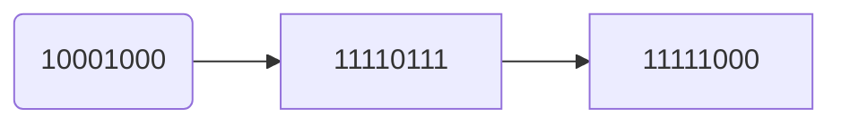

## **第3章 顺序程序设计**

1. ``单选题`` ``简单`` ``3分``

```c
以下选项中可作为C语言数值常量的是（ ）。

A.-80.0✅

B.-080

C.-8e1.0

D.-80.0e
```

**回答正确**

**解析**

C语言中的数值常量有整型常量和实型常量两种，其中整型常量的表示有三种形式：八进制、十进制和十六进制。**八进制数以数字0开头，后跟0\~7数字序列**，**如022和-016都是合法的八进制整型常量**；十进制数以正负号开头（正号可以省略），后跟0\~9数字序列，如**198，-12都是合法的十进制整型常量**；**十六进制数以0x开头，后跟0\~9或A\~F数字序列，如0x13，-0x1C都是合法的十六进制整型常量**。实型常量有两种表示方法：普通形式，一般用小数表示，小数点不能省略，**如3.14**；指数形式，指数的表示通过'e'或'E'后跟**一个整数表示以10为底的幂**，C语言规定'e'或'E'的**前后都必须有数字，并且后边的必须为整数**。B选项是一个非法的八进制整型数据，C选项'e'后边不是整数，而D选项'e'后边没有数字，这都是不合法的实型常量。

**+ 3.0 分**

**2 .** ``单选题`` ``简单`` ``3分``

```c
对于char cx='\039';正确的判断是（ ）。

A.不合法✅

B.cx的值是'\03'

C.cx的值为四个字符

D.cx的值为三个字符
```

**回答正确**

**解析**

本题考查了C语言字符数据的写法，由于cx变量为char类型，**只能接收一个字符数据**，而\'\\039\'如果作为八进制ASCII码表示的数据来对待是不合法的。

\ **八进制**转义

\x **十六进制**转义

**+ 3.0 分**

**3 .** ``单选题`` ``简单`` ```3分```

```c
以下选项中合法的C语言标识符是（ ） 。

A.long

B._2Test✅

C.3Dmax

D.A.dat
```

**回答正确**

**解析**

本题考查C语言标识符的命名规则，**C语言规定标识符中只能含有字母。数字和下划线三种字符**，**不能以数字字符开头**，并且不能使用C语言关键字。long为C语言数据类型关键字，3Dmax以数字字符开头，A.dat包含有'.'字符，都是不符合标识符命名规则的。

**+ 3.0 分**

**4 .** ``单选题`` ``中等`` ``3分``

```c
设有int x=11;则表达式(x++*1/3)的值是（ ）。

A.3✅

B.4

C.11

D.12
```

**回答正确**

**解析**

本题考查了算术混合运算时**运算符的优先级**及含义。表达式中既有**一元运算符也有二元运算**符，C语言规定**一元**运算符**优先级高于二元**运算符，优先级相同的**算术运算符按照从左到右**的次序进行运算，所以表达式等价于（（x++）*1）/3 ,其中自增运算符在变量右边表示先引用变量值在进行自增，/用于整型数据时表示取两数相除的商，因此结果为**11*1/3=3**。

优先级|运算符名称|符号
 ---- | ---- | ---- 
第1优先级|**各种括号**|如**()、[]**等、成员运算符 . 
第2优先级|所有**单目运算符**|如**++、–、!、~**等；
第3优先级|**算数运算符**|乘法运算符*、除法运算符/、求余运算符%；
第4优先级|**算数运算符**|加法运算符+、减法运算符-；
第5优先级|**移位运算符**|移位运算符<<、>>；
第6优先级|**条件运算符**|大于运算符>、大于等于运算符>=、小于运算符<、小于等于运算符<=；
第7优先级|**条件运算符**|等于运算符==、不等于运算符!=；
第8优先级|**按位运算符**|按位与运算符&；
第9优先级|**按位运算符**|按位异或运算符^；
第10优先级|**按位运算符**|按位或运算符|；
第12优先级|**逻辑或运算符**|逻辑或运算符||；
第13优先级|**三目条件运算符** |?: ；
第14优先级|各种**赋值运算符**|如=、+=、-=、*=、/= 等；
第15优先级|**逗号**运算|(,)

**总结：**
**算数运算符>移位运算符>条件运算符>按位运算符>逻辑运算符>赋值**
同一优先级的运算符，运算次序由**结合方向**所决定。

**+ 3.0 分**

**5 .** ``单选题`` ``中等`` ``3分``

```c
设以下变量均为int类型，则值不等于7的表达式是（ ）。

A.(x=y=6,x+y,x+1)

B.(x=y=6,x+y,y+1)

C.(x=6,x+1,y=6,x+y)✅

D.(y=6,y+1,x=y,x+1)
```

**回答正确**

**解析**

本题考查**逗号运算符和逗号表达式**。逗号运算符是所有运算符中优先级最低的，运算时**从左至右**对其中的多个表达式分别计算，而整个逗号表达式的值则为**最右边表达式的值**。

**+ 3.0 分**

**6 .** `单选题` `中等` `3分`

```c
假定有变量定义：int k=6,x=12;则能使x的值为5、k值为6的表达式是（ ）。

A.x%=++k%10

B.x%=k+k%5✅

C.x-=++k%5

D.x-=k++%5
```

**回答正确**

**解析**

本题考查了算术运算符和复合赋值运算符。A选项的表达式等价于x=x%(++k%10),其中自增运算符在变量的左边，变量值先自增在使用，因此表达式运算后k值为7，x值为5；B选项的表达式等价于x=x%(k+k%5)，表达式中不存在修改k值的运算，x最终值为5;C选项的表达式等价于x=x-(++k%5)，表达式运算后k值为7，x值为10；D选项表达式等价于x=x-(k++%5)，自增运算符在变量右边，先引用变量值再进行变量自增，因此，表达式运算后k值为7，x值为11。

**+ 3.0 分**

**7 .** `单选题` `中等` `3分`

```c
设int a=0,b=0,m=0,n=0;则执行(m=a==b)||(n=b==a)后m和n的值是（ ）。

A.0，0

B.0，1

C.1，0✅

D.1，1
```

**回答正确**

**解析**

**真||假==真，有一个真都是真，有一个能到达目标就行**

**真&&假==假，有一个假是假，都要到达目标**

首先要考虑运算符混合运算时的优先级，优先级最高的是（）运算符，然后是括号内的关系运算符，再是括号内的赋值运算符，最后进行括号外的逻辑或运算。**当进行二元逻辑运算时，如果第一个逻辑运算操作数的值已经能够确定逻辑运算的结果，则系统不查看第二个逻辑运算的操作数**。本题中逻辑或运算的第一个操作数(m=a==b)值为1，已经能够确定逻辑或运算的结果为1，因此其第二个操作数不被查看，即描述第二个操作数的表达式不被执行，n的值不被改变。

**+ 3.0 分**

**8 .** `单选题` `中等` `3分`

```c
表达式!x||a==b等效于（ ） 。

A.!((x||a)==b)

B.!(x||y)==b

C.!(x||(a==b))

D.(!x)||(a==b)✅
```

**回答正确**

**解析**

两个表达式等效指变量取值相同时，表达式的结果也相同。本题表达式中包括逻辑运算和关系运算，有一元运算和二元运算，**优先级为一元优先级高于二元优先级**，**关系运算优先级高于逻辑运算**，因此题干中的表达式等价于D选项表达式。

**+ 3.0 分**

**9 .** `单选题` `中等` `3分`

```c
若有int i=5,j=4,k=6;float f;执行语句

f=(i<j&&j<k)?i:(j<k)?j:k;

后f的值为（ ）。

A.4.0✅

B.5.0

C.6.0

D.7.0
```

**回答正确**

**解析**

**条件运算符的结合性为自右向左**。因此f=(i\<j&&j\<k)?i:(j\<k)?j:k;等价于f=(i\<j&&j\<k)?i:((j\<k)?j:k);先计算出(j\<k)?j:k的值，为4，将该值参与第二次条件运算；第二次条件运算的表达式1为(i\<j&&j\<k)，表达式2为i，表达式3为(j\<k)?j:k，因此第二次条件运算的结果为4。因此f的值为4.0。

**+ 3.0 分**

**10 .** `单选题` `简单` `3分`

```c
若变量已正确定义并赋值，下面符合C语言语法的表达式是（ ）。

A.a:=b+1

B.a=b=c+2✅

C.int(18.5%3)

D.a=a+7=c+b
```

**回答正确**

**解析**

本题考查C语言中变量定义和赋值的语法，**C选项中%运算符只能用于整形数据的计算中**。

**+ 3.0 分**

**11 .** `单选题` `中等` `3分`

$与数学公式3x^n/(2x-1)对应的C语言表达式是（ ）。$

```c
A.
3*x^n/(2*x-1)

B.
3*x**n/(2*x-1)

C.
3*pow(x,n)/(2*x-1)✅

D.
3*pow(n,x)/(2*x-1)
```

**回答正确**

**解析**

C语言中没有进行指数运算的运算符，指数运算依靠数学函数pow完成。

**+ 3.0 分**

**12 .** `单选题` `中等` `3分`

```c
设x，y，u，v均为浮点型，与数学公式(x*y)/(u*v)不等价的C语言表达式是（
）。

A.x*y/u*v✅

B.x*y/u/v

C.x*y/(u*v)

D.x/(u*v)*y
```

**回答正确**

**解析**

这个题目包括数学表达式转换成C语言表达式时需要注意的问题，符号的书写，运算顺序的表示等。

**+ 3.0 分**

**13 .** `单选题` `简单` `3分`

```c
类型修饰符unsigned不能修饰（ ）。

A.char

B.int

C.long int

D.float✅
```

**回答正确**

**解析**

C语言中**无符号数据类型包括无符号整型、无符号短整型、无符号长整型、无符号字符型**。

**+ 3.0 分**

**14 .** `单选题` `简单` `3分`

```c
下列选项中，均是合法的C语言整型常量的是（ ）。

A.160 -0xffff 0011✅

B.-0xcdf 01a 0xe

C.-01 986,012 0668

D.-0x48a 2e5 0x
```

**回答正确**

**解析**

一个整型常量可以用3种不同的方式表示：

（1）十进制整数。以非零十进制数1～9组成的整数，例如135
，-246等；

（2）八进制整数。以0开头和八进制数0～7组成的整数，例如0，012，0177等；

（3）十六进制整数。以0x或0X开头和十六进制数0～9.A～F或a～f组成的整数（字母大小写任意），例如0x1234，0xab，0xCF等。B选项中01a不合法，C选项中986，012以及0668不合法，D选项中2e5以及0X不合法。

**+ 3.0 分**

**15 .** `单选题` `简单` `3分`

```
C语言中将-8赋值给无符号字符型，则它的内存数据形式为（ ）。

A.11111000✅

B.10001000

C.00001000

D.11110111
```

**回答正确**

**解析**



假定字长为8位时，-8的补码为11111000，赋值给无符号字符型时未发生溢出截断，所以仍为1111000。

|      |                      |
| ---- | -------------------- |
| %c   | 一个字符             |
| %d   | 有符号十进制整数     |
| %e   | 浮点数、e-记数法     |
| %f   | 浮点数、十进制记数法 |
| %o   | 无符号八进制整数     |
| %p   | 指针                 |
| %s   | 字符串               |
| %u   | 无符号十进制整数     |
| %x   | 使用十六进制数字     |
| %%   | 打印一个百分号       |
| %ld  | long                 |
| %hd  | short                |
| %lld | long long            |
| %u   | unsigned int         |
| %hu  | unsigned short       |
| %llu | unsigned long long   |
| %lu  | unsigned long        |

**+ 3.0 分**

**16 .** `单选题` `简单` `3分`

```c
设char a='\70';则变量a（ ）。

A.包含1个字符✅

B.包含2个字符

C.包含3个字符

D.说明不合法
```

**回答正确**

**解析**

转义字符的一种写法"\\ooo"， 用1～3位八进制数ooo为码值所对应的字符。

**+ 3.0 分**

**17 .** `单选题` `简单` `3分`

```c
（ ）是非法的C语言转义字符。

A.\b

B.\0xf✅

C.\037

D.\r
```

**回答正确**

**解析**

转义字符的一种写法"\\xhh"，
用1～2位十六进制数hh为码值所对应的字符。所以B选项错误。

常用的转义字符见下表

| 转义字符                              | 字符值                       | 输出结果                             |
| ------------------------------------- | ---------------------------- | ------------------------------------ |
| \\’                                   | 一个单撇号（’）              | 输出此字符                           |
| \\"                                   | 一个双撇号（"）              | 输出此字符                           |
| \\?                                   | 一个问号（?）                | 输出此字符                           |
| \                                     | 一个反斜线（\\）             | 输出此字符                           |
| \\a                                   | 警告（alert）                | 产生声音或视觉信号                   |
| \\b                                   | 退格（backspace）            | 将当前位置后退一个字符               |
| \\f                                   | 换页（form feed）            | 将当前位置移动到下一页的开头         |
| \\n                                   | 换行                         | 将当前位置移动到下一行的开头         |
| \\r                                   | 回车（carriage return）      | 将当前位置移动到本行的开头           |
| \\t                                   | 水平制表符                   | 将当前位置移动到下一个tab位置        |
| \\v                                   | 垂直制表符                   | 将当前位置移动到下一个垂直制表对齐点 |
| \\ooooo（其中o）代表一个八进制数字    | 与该八进制码对应的ASCⅡ字符   | 与该八进制码对应的字符               |
| \\xhhhhh（其中h代表一个十六进制数字） | 与该十六进制码对应的ASCⅡ字符 | 与该十六进制码对应的字符             |

本文只讨论倒数两行的十六以及八进制转义字符的使用

**+ 3.0 分**

**18 .** `单选题` `简单` `3分`

```c
以下选项中（ ）不是C语言常量。

A.e-2✅

B.012

C."a"

D.'\n'
```

**回答正确**

**解析**

实型常量的一种写法为指数形式，又称科学记数法表示。以fEn 或fen
格式组成的浮点数，其中E 或e 表示以10为低的幂， n为指数且必须是整型，
f可以是整数或小数。所以A选项错误。

**+ 3.0 分**

**19 .** `单选题` `简单` `3分`

```c
以下不是C语言支持的存储类别的是（ ）。

A.auto

B.static

C.dynamic✅

D.register
```

**回答正确**

**解析**

在变量定义时可以使用存储类别修饰符**auto、static、register来限定变量的存储类别**，使用extern来声明变量的外部连接属性。存储类别是指变量的存储空间分配方式，auto是变量默认的存储类别，称为自动变量；static是静态存储类别的变量，称为静态变量；register称为寄存器变量。

**+ 3.0 分**

**20 .** `单选题` `中等` `3分`

```c
已知short x=0xabcde; 则x的结果是（ ）。

A.赋值非法

B.不确定

C.abcd

D.bcde✅
```

**回答正确**

**解析**

一般地，超过最大值的有符号整型数值会向上溢出变成负数，超过最小值的数据会向下溢出变成正数。

**+ 2.0 分**

**21 .** `单选题` `中等` `2分`

```c
若int k=7,x=12;则值为3的表达式是（ ）。

A.
x%=(k%=5)

B.
x%=(k-k%5)

C.
x%=k-k%5

D.✅
(x%=k)-(k%=5)
```

**回答正确**

**解析**

A选项等价于：(1)k=k%5运算后k值为2；(2)
x=x%k运算后x值为0，赋值表达式值为0。B选项等价于：x=x%(k-k%5)，其中k-k%5的值为5，所以整个表示式运算后x值2，表达式值为2。
C选项等价与B选项。D选项等价于：(x=x%k)-(k=k%5)，其中x=x%k值为5，k=k%5表达式值为2，因此D选项表达式值为3。

**+ 2.0 分**

**22 .** `单选题` `中等` `2分`

```c
对于语句：f=(3.0,4.0,5.0),(2.0,1.0,0.0)；的判断中，（ ）是正确的。

A.
语法错误

B.
f为5.0

C.✅
f为0.0

D.
f为2.0
```

**回答正确**

**解析**

f=(3.0,4.0,5.0),(2.0,1.0,0.0)是一个**逗号表达式**，**赋值优先于逗号表达式**，第一个子表达式为f=(3.0,4.0,5.0)，因此f的值是逗号表达式(3.0,4.0,5.0)的值5.0；

f=(3.0,4.0,5.0),(2.0,1.0,0.0)这整个逗号表达式的值为子表达式(2.0,1.0,0.0)的值0.0。

逗号表达式的求解过程是：**先求解表达式1，再求解表达式2。整个逗号表达式的值是表达式2的值**

**+ 0.0 分**

**23 .** `单选题` `困难` `2分`

```c
设变量n为float类型，m为int型，则以下表达式能实现将n中的数值保留小数点后两位，第三位进行四舍五入运算。

A.
n=(n*100+0.5)/100.0

B.✅
m=n*100+0.5,n=m/100.0

C.
n=n*100+0.5/100.0

D.
n=(n/100+0.5)*100.0
```

**回答错误**

**解析**

很明显C和D选项不正确。A和B选项的差别仅在于A选项为两个实数相除，如对于12.123，最后n的值为12.128，没有达到四舍五入效果；而B选项先对12.123*100+0.5的结果转换为整型，所以m的值12.12（截掉了小数部分；如果第三位小数值大于等于5，此时整数部分会变为13），因此再除以100.0，n的值为12.12，相当于实现了第三位进行四舍五入运算。

**+ 2.0 分**

**24 .** `单选题` `中等` `2分`

```c
若变量a为int类型，且其值为3，则执行表达式a+=a-=a*a后，a的值是（ ）。

A.-3

B.9✅

C.-12

D.6
```

**回答正确**

**解析**

a+=a-=a*a等价与a=a+(a=a-a*a);括号运算后a的值为-6，括号内表达式值为-6；所以最后表达式值为-6+-6=-12。

a=a+(a-=a*a)

a=a+(a=a-a*a)

a=-6,a=-6-6

**+ 2.0 分**

**25 .** `单选题` `简单` `2分`

```c
关于C程序在作逻辑运算时判断操作数真、假的表述中，正确的是（ ）。

A.✅
0为假，非0为真

B.
只有1为真

C.
-1为假，1为真

D.
0为真，非0为假
```

**回答正确**

**解析**

逻辑运算符的运算对象可以是常量、变量或表达式，按逻辑值对待。在C语言中，非0数据当作真、0当作假。一般情况下，逻辑运算符的运算对象应是关系运算、逻辑运算的结果。因为这两种运算的结果是逻辑值，符合其要求。

**+ 2.0 分**

**26 .** `单选题` `简单` `2分`

```c
关于C程序关系运算、逻辑运算后得到的逻辑值的表述中，正确的是（ ）。

A.
假为0，真为随机的一个非0值

B.✅
假为0，真为1

C.
假为-1，真为1

D.
假为0，真为不确定的值
```

**回答正确**

**解析**

关系运算符的运算规则是：若关系成立，结果为真；关系不成立，结果为假。C语言中用数值1表示真、用数值0表示假。

**+ 2.0 分**

**27 .** `单选题` `中等` `2分`

```c
设int i=10;表达式30-i<=i<=9的值是（ ）。

A.0

B.1✅

C.9

D.20
```

**回答正确**

**解析**

`30-i<=i<=9`的计算过程为：先计算出30-i\<=i的值(为0或1)，然后用该值进行\<=9的第二次关系运算。因此表达式结果为真，即1。

**+ 2.0 分**

**28 .** `单选题` `简单` `2分`

```c
表达式!x等效于（ ）。

A.x==1

B.x==0✅

C.x!=1

D.x!=0
```

**回答正确**

**解析**

表达式等效极为变量x取值相同时，两个表达式值相同。

**+ 2.0 分**

**29 .** `单选题` `中等` `2分`

```
设int a=1,b=2,c=4;经过表达式(c=a!=b)&&(a==b)&&(c=b)运算后，a、b和c的值分别是（）。

A.1，2，0

B.1，2，1✅

C.1，2，2

D.1，2，3
```

**回答正确**

**解析**

C语言逻辑与表达式（expr1 &&expr2）的执行过程是：

先计算expr1的值，若expr1的值为真，则计算expr2的值，并根据expr2的值结合真值表决定（expr1&&expr2）的结果（当expr2为真时，结果为真，否则结果为假）；**若expr1的值为假，则不再计算expr2的值**，直接得到（expr1&&expr2）的结果为假。在题目中第一次逻辑与运算中，expr1值为真，因此计算expr2即a==b的值，值为假，因此第一次逻辑与运算的结果为假。该结果作为第二次逻辑与运算的expr1，因此按逻辑与的执行过程，第二次逻辑与运算的expr2不再计算，即c=b没有执行，c保持第一次修改的值（即a!=b表达式的值1）。

**+ 2.0 分**

**30 .** `单选题` `简单` `2分`

```c
表达式0x13 ^ 0x17的值是（ ）。

A.0x04✅

B.0x13

C.0xe8

D.0x17
```

**回答正确**

**解析**

参加运算的两个数据按二进制位进行异或运算，所谓异或是指两个二进制数相同为0，相异为1

运算规则是：

0 \^ 0 = 0，0 \^ 1 = 1，1 \^ 0 = 1，1 \^ 1 = 0。
0x13\^0x17即为00010011\^00010111=00000100，即为0x04。

```c
1.按位与（&）
将参加运算的两个数据，按二进制位进行"与"运算。两个都是一则为一

举例: 3 & 5

3 => 0000 0000 0000 0011

5 => 0000 0000 0000 0101

&      0000 0000 0000 0001 转换成十进制也就是1


2.按位或（|）
将参加运算的两个数据，按二进制位进行"或"运算。两个中有一个是一则为一

举例: 3 | 5

3 => 0000 0000 0000 0011

5 => 0000 0000 0000 0101

|       0000 0000 0000 0111 转换成十进制也就是7


3.按位取反（~）
将数据，按二进制位进行"取反"运算。零变成一，一变成零

举例: ~6

6 => 0000 0000 0000 0110

~      1111 1111 1111 1010 转换成十进制也就是-7


4.异或（^）
将参加运算的两个数据，按二进制位进行"与"运算。相同为零，不同为一

举例: 3 ^ 5

3 => 0000 0000 0000 0011

5 => 0000 0000 0000 0101

^      0000 0000 0000 0110 转换成十进制也就是6
```

**+ 2.0 分**

**31 .** `单选题` `简单` `2分`

```
若有定义int x=2,y=3;则x & y的值是（ ）。

A.0

B.2✅

C.3

D.5
```

**回答正确**

运算规则是： 

0 & 0 = 0，0 & 1 =0，1 & 0 = 0，1 & 1 = 1 

x&y即为00000010&00000011=00000010，即为2。

**+ 2.0 分**

**32 .** `单选题` `简单` `2分`

```c
若有定义char c1=92,c2=92;则以下表达式中值为零的是（ ）。

A.
~c2

B.
c1&c2

C.✅
c1^c2

D.
c1|c2
```

**回答正确**

**解析**

参加运算的两个数据按二进制位进行异或运算，所谓异或是指两个二进制数相同为0，相异为1，运算规则是：0 \^ 0 = 0，0 \^ 1 = 1，1 \^ 0 = 1，1 \^ 1 =0。c1和c2值相等，所以按位异或结果为零。

~：对一个数的二进制**按位取反**

**+ 2.0 分**

**33 .** `单选题` `简单` `2分`

```c
以下不能正确计算数学公式值的C语言表达式是（ ）。

A.✅
1/3*sin(1/2)*sin(1/2)

B.
sin(0.5)*sin(0.5)/3

C.
pow(sin(0.5),2)/3

D.
1/3.0*pow(sin(1.0/2),2)
```

**回答正确**

**解析**

A选项中/运算符使用了**整数相除的含义**，因此与表达式含义不同。

**+ 2.0 分**

**34 .** `单选题` `简单` `2分`

```c
若x和y为整型数，以下表达式中不能正确表示数学关系 |x-y| < 10的是（）。

A.
abs(x-y) < 10

B.
x-y > -10 && x-y < 10

C.✅
!(y-x)>10 || !(x-y) < -10

D.
(x-y)*(x-y) < 100
```

**回答正确**

**解析**

选项A)中，abs本身就是求绝对值的函数，所以是正确的；选项B)是把\|x-y\|＜10表示成了数学表达式中的-10＜(x-y)＞＜10，然后再用C语言规则表示出来的；选项D)相当于把
\|x-y\|＜10两边同时平方，此处表达也是正确的；而选项C)中**!(x-y)＜-10相当于(x-y)＞=-10，!(y-x)＞10相当于(x-y)＞=-10**，故选项C)相当于(x-y)＞=-10，所以错误。

**+ 2.0 分**

**35 .** `填空题` `中等` `2分`

```c
设有char a,b; 

若要通过
a&b运算屏蔽掉a中的其它位，只保留第1和第7位（右起为第0位），则b的二进制数是_10000010__。
```

**回答正确**

**解析**

本题利用位运算中&的特性，&运算时当一个操作数某位为0时，结果的当前位一定为0，即为屏蔽；当某位为1时，结果的当前位与另一个操作数的当前位相同，即为保留。同理，按位或位运算具有将某些位置1的功能，并且可以通过与操作数自身进行异或位运算来检验操作数是否为0。

**+ 0.0 分**

**36 .** `填空题` `简单` `2分`

```c
把int型变量low中的低字节及int型变量high中的高字节放入int型变量s中的表达式是_s=low&0x00ff+high&0xff00__。
```

**解析**

**+ 2.0 分**

**37 .** `填空题` `简单` `2分`

```c
表达式((4|1)&3)的值是_1__。
```

**回答正确**

**解析**

4\|1的结果为00000100\|00000001=5，

5&3的结果为00000101&00000011=1。

**+ 2.0 分**

**38 .** `填空题` `简单` `2分`

```c
表达式10<<3+1的值是_160__。
```

**回答正确**

**解析**

10\<\<3+1相当于10\<\<(3+1)，即将10按位左移4位，相当于乘2的动作做4次。

**+ 0.0 分**

**39 .** `填空题` `简单` `2分`

```c
写出条件"y能被4整除但不能被100整除，或y能被400整除也能被100整除"的C语言表达式 (y%4==0&&y%100!=0)||(y%400==0)&&(y%100==0)
```

**+ 0.0 分**

**40 .** `填空题` `简单` `2分`

```c
判断变量a、b、c的值是否是一个等差数列中连续三项的C语言表达式为 b-a==c-b||c-a==b-c||a-b==c-a||c-b==a-c||a-c==b-a||b-c==a-b
```
